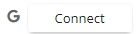

# Connect to your Google account

You can connect your CommunityBridge account to your Google account.

1. On the Account Settings page, click **Connect**   next to the Google account symbol. You are navigated to your Google login page.
2. Select the Google account. The Connect but changes to green color confirming the successful connection. 

The text on the button changes to *Connected*.

# To Disconnect your Google Account

1. When you move your mouse over the green *Connected* button, you are provided with an option to *disconnect* from your Google account. The text changes to *Disconnect*. 

2. Click **Disconnect**. On the Confirm Social Disconnection window, click **Yes** to confirm your disconnection. You are now disconnected from your social Google account.

More on Managing your profile [here](Account-Settings.md).
