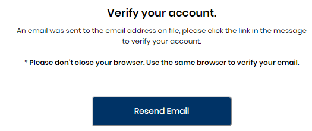
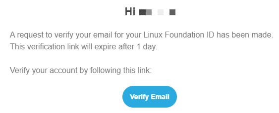

# Log In or Sign Up

- Create an account
- Verify email
- Login with your Linux Foundation Id
- Forgot password
- Login with Google
- Login with GitHub

##  Create an account

If this is the first time you are logging in to Linux Foundation, you need to first create an account. To create a Linux Foundation account, do the following:

1. Go to [Linux Foundation Confluence website.](https://confluence.linuxfoundation.org/)

2. Click <b>Create Account</b>. 

3. On the Create a Linux Foundation Account page, enter your email address, Username, First name, Last name and Password .
   
   **_NOTE:_** <ul><li>Make sure you enter a valid email address. Also, because you are creating an account for the first time, you cannot enter an already existing email address.</li><li>The Username is alphanumeric and should be atleast 8 characters long.</li><li>The First name and the Last name should be atleast 2 characters long.</li><li>The password must have at least 8 characters, including upper, lower, numeric, and special characters.</li></ul>
   
   

4. Click <b>Create Account</b>. You are directed to the <i>Verify your account</i> page. If you did not receive an email, click **Resend Email**.

   

##  **Verify Email**

When you create a new account, an account verification email is sent to your registered email address. To verify your account, do the following:

1. Open your registered email account and open the verification email. An example of the email is as follows:

2. Click <Verify Email</b>. A confirmation message that the email has been verified is displayed.

You will be directed to Login page.

##  **Login with your Linux Foundation Id**

After you have created a new account and verified the account, you can now log in using your Linux Foundation ID. To log in to your Linux Foundations' account, do the following:

1. Go to [Linux Foundation Confluence website.](https://confluence.linuxfoundation.org/).

2. Enter your Linux Foundation Email/Username and Password, and click **Sign in**.

. You are now logged in to Linux Foundation.

## **Forgot password**

If you do not remember your Linux Foundation login password, you can submit a password reset request. The request sends an email to your registered email address and from that email, you can set a new password.
To reset your password, do the following:

1. Go to [Linux Foundation Confluence website.](https://confluence.linuxfoundation.org/)
2. On the Sign In page, click **Forgot Password?**. The ”Forgot your Password?” page appears.

   
   
3. Enter your Email/Username and click **Reset Password**. A confirmation message informs you:

   

4. Check your email inbox for a “Reset Password” email and open it. If you did not receive an email, click **Did not Receive Link** in the ”Forgot your Password?” pane to resend the email. The status bar informs you:

   
   
5. Open the <i>Reset Password</i> email from your registered email account. 

   

6. Click **Reset Password** in the email. On the <i>Change Password</i> page, enter New Password and Confirm Password, and click **Submit**. Your passowrd is reset.

    
    
    **_NOTE:_** The New Password and Confirm Password should be exactly identical.
 
##  **Login with Google**

Social login is a single sign-on for end users. You can use your existing login credentials from Google to log in to the Linux Foundations rather than creating a new Linux Foundations account. During your initial login, you enter your Google credentials to authenticate your Google account. Subsequent logins do not require you to enter your credentials⏤you simply click **Login with Google**.

 #### Initial login: 

1. Go to [Linux Foundation Confluence website.](https://confluence.linuxfoundation.org/)
2. On the login screen, click 'Login with Google'.
3. Enter your email or phone number and click **Next**.
4. Enter your password, and click **Next**.
5. Enter the Username, accept the **Terms and condition** and click **Create account**.

The Linux Foundations' Dashboard appears. Your user account appears in the top-right corner, above the Navigation pane:

####  Subsequent login:

Subsequent logins do not require you to enter your credentials. You can click 'Login with Google' option. This one-click approach simplifies your logins.

## **Login with GitHub**

You can use your existing login credentials from GitHub (social network provider) to log in to Linux Foundations rather than creating a Linux Foundations account. During your initial login, you enter your GitHub credentials to authenticate your GitHub account. Subsequent logins do not require you to enter your credentials⏤you simply click **Login with GitHub**. This one-click approach simplifies your logins.

 #### Initial login: 

1. Go to [Linux Foundation Confluence website.](https://confluence.linuxfoundation.org/)
2. Click 'Login with GitHub' option at the bottom.

3. Enter Username or Email address and password.
4. Click **Sign-in**.
5. Enter the Username, accept the **Terms and condition** and click **Create account**.

   The Linux Foundations' Dashboard appears. Your user account appears in the top-right corner, above the Navigation pane:

####  Subsequent login:

Subsequent logins do not require you to enter your credentials. You can click 'Login with GitHub' option. This one-click approach simplifies your logins.
