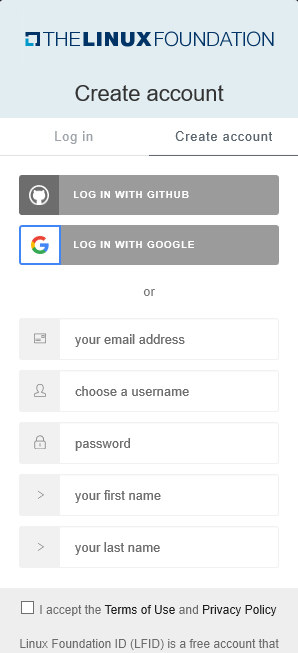
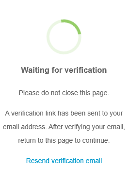
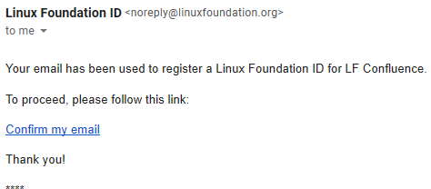
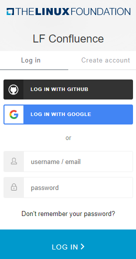

# Log In or Sign Up

- Create an account
- Verify email
- Login with your Linux Foundation Id
- Forgot password
- Login with Google
- Login with GitHub

##  Create an account

If this is the first time you are logging in to Linux Foundation, you need to first create an account. To create a Linux Foundation account, do the following:

1. Go to the [Linux Foundation Login page.](https://sso.linuxfoundation.org/login?state=g6Fo2SBNdGJJelo4Q3NZRlIyX2hxMll3c0NDMkRVRjNwdzBIcaN0aWTZIHYtMmZwU04ta2MtQnR3TWE5RlFwajBLcE5JOWk2OVlOo2NpZNkgVmFGcUU0VjRyWTlTdzhSd2g5RExSMFVGektjbXJSczY&client=VaFqE4V4rY9Sw8Rwh9DLR0UFzKcmrRs6&protocol=samlp)
2. Click <b>Create Account</b>. 

3. Enter your email address, username, password, first name, and last name .
   
   **_NOTE:_** <ul><li></li>Make sure you enter a valid email address. Also, because you are creating an account for the first time, you cannot enter an already existing email address.<li>The Username is alphanumeric and should be atleast 8 characters long.</li><li>The First name and the Last name should be atleast 2 characters long.</li><li>The password must have at least 8 characters, including upper, lower, numeric, and special characters.</li></ul>
4. Select [I accept the Terms of Use and Privacy Policy](https://www.linuxfoundation.org/terms/) option.
5. Click <b>Create Account</b>.

6. A verification message appear on your screen. Click <b>Resend Email</b> if you did not receive an account verification email from Linux Foundations.

##  **Verify Email**

When you create a new account, an account verification email is sent to your registered email address. To verify your account, do the following:

1. Open your registered email account and open the email with Subject as **Verify your Linux Foundation ID email** from Linux Foundation. An example of the email is as follows:

2. Click <b>Confirm my email</b>. A confirmation message that the email has been verified is displayed.

You will be directed to the Home page of Linux Foundation.

##  **Login with your Linux Foundation Id**

After you have created a new account and verified the account, you can now log in using your Linux Foundation ID. To log in to your Linux Foundations' account, do the following:

1. Go to [Linux Foundation Confluence website.](https://confluence.linuxfoundation.org/) and click Login  on the top-right corner of the page.

2. On the Login page, enter your Linux Foundation credentials and click **Log in**.

3. Your user account name appears in the top-right corner, above the Navigation pane.

## **Forgot password**

If you do not remember your Linux Foundation login password, you can submit a password reset request. The request sends an email to your registered email address and from that email, you can set a new password.

To reset your password, do the following:

1. Go to [Linux Foundation Confluence website.](https://confluence.linuxfoundation.org/)
2. Click **Forgot Password?**. The ”Forgot your Password?” page appears.

   
   
3. Enter your email address or username and click **Reset Password**. A confirmation message informs you:

   

4. Check your email inbox for a “Reset Password” email and open it. If you did not receive an email, click **Did not Receive Link** in the ”Forgot your Password?” pane to resend the email. The status bar informs you:

   
   
5. Click **Reset Password** in the email. The Change Password page appears:

   
 
##  **Login with Google**

Social login is a single sign-on for end users. You can use your existing login credentials from Google to log in to the Linux Foundations rather than creating a new Linux Foundations account. During your initial login, you enter your Google credentials to authenticate your Google account. Subsequent logins do not require you to enter your credentials⏤you simply click **Login with Google**.

 #### Initial login: 

1. Go to [Linux Foundation Confluence website.](https://confluence.linuxfoundation.org/)
2. On the login screen, click 'Login with Google'.
3. Enter your email or phone number and click **Next**.
4. Enter your password, and click **Next**.
5. Enter the Username, accept the **Terms and condition** and click **Create account**.

The Linux Foundations' Dashboard appears. Your user account appears in the top-right corner, above the Navigation pane:

####  Subsequent login:

Subsequent logins do not require you to enter your credentials. You can click 'Login with Google' option. This one-click approach simplifies your logins.

## **Login with GitHub**

You can use your existing login credentials from GitHub (social network provider) to log in to Linux Foundations rather than creating a Linux Foundations account. During your initial login, you enter your GitHub credentials to authenticate your GitHub account. Subsequent logins do not require you to enter your credentials⏤you simply click **Login with GitHub**. This one-click approach simplifies your logins.

 #### Initial login: 

1. Go to [Linux Foundation Confluence website.](https://confluence.linuxfoundation.org/)
2. Click 'Login with GitHub' option at the bottom.

3. Enter Username or Email address and password.
4. Click **Sign-in**.
5. Enter the Username, accept the **Terms and condition** and click **Create account**.

   The Linux Foundations' Dashboard appears. Your user account appears in the top-right corner, above the Navigation pane:

####  Subsequent login:

Subsequent logins do not require you to enter your credentials. You can click 'Login with GitHub' option. This one-click approach simplifies your logins.
