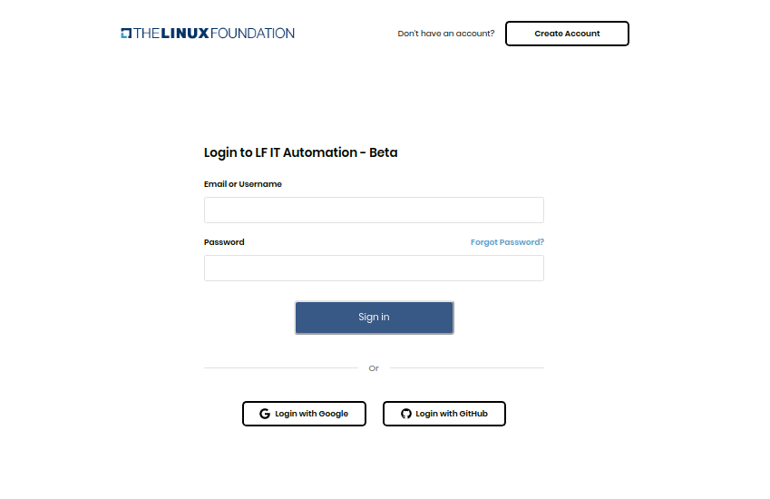
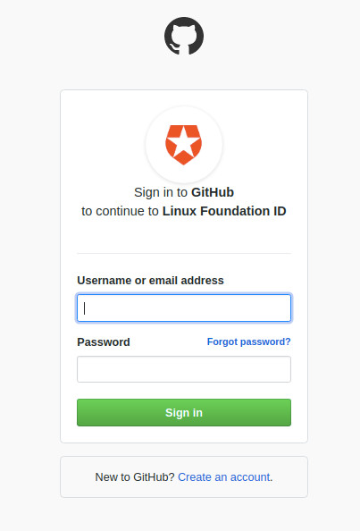

# Log In or Sign Up

<ul><li>Create an account</li><li>Verify email</li><li>Login</li><li>Forgot password</li><li>Login with Google</li><li>Login with GitHub</li></ul>

>####  **Create an account**

To create a Linux Foundation account, do the following:

1. Go to [Linux Foundation Confluence website.](https://console.dev.itx.linuxfoundation.org/#/)
2. Click <b>Create Account</b> button. 
3. Enter your Email address, Username, First name, Last name, and Password.
4. Click the <b>Create Account</b> button.

You are directed to the Verify Account page

User can click on the 'Resend Email' button if the user did not receive an email from the Linux foundation on their respective email account.

>#### 2. **Verify email**

To verify the your account, use the following steps :

- Open your respective Email account and open the email received from Linux foundation.

- Click on the 'Verify account' button.
- it will redirect the user to 'Log in' screen.

>#### 3. **Login**

You can log in to your Linux foundation account, by using the following easy steps.

- Visit [Linux Foundation Confluence website.](https://console.dev.itx.linuxfoundation.org/#/)
- Enter your Email/Username and password.
- Click on 'Sign in' button.

>#### 4. **Forgot password**

If you do not remember your Linux Foundation login password, you can submit a password reset request. A request sends an email to your registered email address and from that email, you can set a new password.

You can reset your password, using the following steps:

- Visit [Linux Foundation Confluence website.](https://console.dev.itx.linuxfoundation.org/#/)
- Click on [Forgot password?](https://linuxfoundation-dev.auth0.com/login/?state=g6Fo2SBxei12M2tXYVVMUDdFenR5UTExeEhMZGFGeDlNWmhtM6N0aWTZIHM4dTh2SjhkRlY0cEp4clY4OTlUdHZfSlR0aWJSMGlFo2NpZNkgN0R4dDJva3cxeVRSZ3BxNXBqNk1mbURrMFJGdlphZ0M&client=7Dxt2okw1yTRgpq5pj6MfmDk0RFvZagC&protocol=oauth2&prompt=login&response_type=token%20id_token&redirect_uri=https:%2F%2Fconsole.dev.itx.linuxfoundation.org&scope=manage:projects%20read:projects%20manage:domains%20manage:forwards%20manage:github%20manage:groupsio&audience=https:%2F%2Fapi.dev.itx.linuxfoundation.org%2F&nonce=k7O7GkEu8H3qQA8qxARpvhZqQ06Q6QC.&auth0Client=eyJuYW1lIjoiYXV0aDAuanMiLCJ2ZXJzaW9uIjoiOS4xMC4xIn0%3D) link 

- Enter your username or email address. 
- Click on the 'Reset password' button.

you will receive a link to reset your password, on your registered email address.

- if you did not receive the 'Reset password email' on your registered email address, then click on 'Did not receive link' button, which will send you the new ''Reset password email'

_*Set new password: *_

- Go to your respective email account and open the 'Reset password email you received from the Linux foundation.

- Click on the 'Reset password' button, it will redirect you to the change password screen.

- Enter your new password in the 'New password' and 'Confirm password' field.
- Click on the 'Submit' button.
- The "password changed successfully messaged will get displayed and you will get redirect to the Login screen again, where you can log in to the portal with your Email/Username and a new password.

>#### 5. **Login with Google**

Social login is a single sign-on for end users. You can use your existing login credentials from Google to log in to the LFX portal rather than creating a new account. During your initial login, you enter your Google credentials to authenticate your Google account. 

 _*Initial login: *_

- Visit [Linux Foundation Confluence website.](https://console.dev.itx.linuxfoundation.org/#/)
- Click on 'Login with Google' option at the bottom

- Enter your email or phone number and click the next button.
- Enter your password and click on the Next button.
- Now enter the username, check the terms and condition checkbox and click on create account.

- It will redirect you to the home screen.

_*Subsequent login: *_

Subsequent logins do not require you to enter your credentials.you simply click on 'Login with Google' option. This one-click approach simplifies your logins.

>#### 6. **Login with GitHub**

Users can also login using GitHub credentials, using the following steps. During your initial login, you enter your GitHub credentials to authenticate your GitHub account. Subsequent logins do not require you to enter your credentials.you simply click Login with GitHub. This one-click approach simplifies your logins.

_*Initial login: *_

- Visit [Linux Foundation Confluence website.](https://console.dev.itx.linuxfoundation.org/#/)
- Click on 'Login with GitHub' option at the bottom.

- Enter Username/Email address and password.
- Click on Sign-in button.
- Now enter the username, check the terms and condition checkbox and click on create an account.

- It will redirect you to the home screen.

_*Subsequent login: *_

Subsequent logins do not require you to enter your credentials.you simply click on 'Login with GitHub' option. This one-click approach simplifies your logins.

---
---
