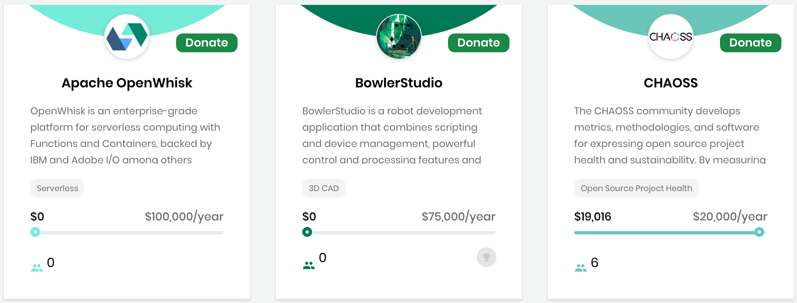

# Dashboard

## Getting Started 

1. Browse or search for projects and learn more:
   * [Projects and Mentorships](projects-and-mentorships.md)
   * [Events](events.md)
   * [Travel Scholarships](travel-scholarships.md)
   * [Integrated Services for a Project](integrated-services-for-a-project.md)
   * [Search](search.md)
   * [Toggle Between Funding and Mentorship for a Project](toggle-between-funding-and-mentorship-for-a-project.md)

## Projects and Mentorships 

**Projects and Mentorships** \(the default selection\) lists GitHub and Git projects, and projects that support the Mentorship program. Project overview information appears such as the number of backers and the CII badgefor a participant in the [Core Infrastructure Initiative \(CII\) Badge Program](https://www.coreinfrastructure.org/programs/badge-program/). The color of the badge represents the CII status. For each project, a bar shows the donation progress towards the total annual funding goal. **Donate** lets you donate funds to a project that you want to support.  

## Events 

**Events** lists events such as forums or conferences. Event funds can benefit and reimburse organizers for event expenses such as for a venue or food. For each event, a bar shows the donation progress towards the total annual funding goal, and the event beginning and end dates. **Sponsor** lets you donate funds to an event that you want to support. **Register** lets you register to attend the event.  

## Travel Scholarships 

**Travel Scholarships** lists funds for travel expenses, for example a scholarship to attend a women's conference. For each scholarship, a bar shows the donation progress towards the total annual funding goal. **Donate** lets you donate to a scholarship that you want to support.

