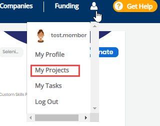

# Manage Mentee Application

You can manage your project mentees from the Mentees tab on the project detail page.  This tab lists all the mentee applicants. After an individual creates a mentee profile and applies to a project, the person becomes a mentee applicant for the project. An email notification informs you that the person showed interest in participating in the project's Mentorship program. 


* After a mentee applies to a project, the mentee's name shows under **Mentees** tab with application status **Pending**, by default..
* After you accept a mentee application from Application Status drop-down, accepted mentee's profile appears under the Mentees section on the profile tab of your project.


**To Manage Mentee Application:**

1. [Log in](../../user-account/docs-login-to-communitybridge/) to [CommunityBridge Mentorship.](https://people.communitybridge.org/)

2. Go to your account and select **My Projects** from the drop-down list.  
  
  
An overview of each of your projects appears.

3. Click a project for which you want to manage mentee application.

4. Navigate to **Mentees** tab.

A list of the persons who have applied to your project appears. The following table describes the additional information:

<table>
  <thead>
    <tr>
      <th style="text-align:left">Name</th>
      <th style="text-align:left">Description</th>
    </tr>
  </thead>
  <tbody>
    <tr>
      <td style="text-align:left"><b>Name</b>
      </td>
      <td style="text-align:left">Shows mentee details.</td>
    </tr>
    <tr>
      <td style="text-align:left"><b>Application Status</b>
      </td>
      <td style="text-align:left">
        
Application Status<b> </b>shows the status of the applicant&apos;s application.
          By-default, it shows <b>Pending</b>. To change the application status, select
          a <b>status</b> from the Application Status drop-down list:

        <ul>
          <li><b>Pending: </b>Mentee has applied to the mentorship program, and can
            see the tasks to complete. You must review the application by viewing mentee&apos;s
            profile. Click
            <b> </b>to view mentee profile.</li>
          <li><b>Declined:</b> You can decline an application if mentee application/profile
            is not suitable for the mentorship program.</li>
          <li><b>Accepted: </b>If you select <b>Accepted</b>, mentee gets an email notification
            that his/her profile is accepted.</li>
          <li><b>Withdrawn: </b>Status changes to <b>Withdrawn</b> when a mentee withdraws
            an application.</li>
          <li><b>Graduated: </b>Change the status to <b>Graduated </b>when a mentee successfully
            completes the mentorship program.</li>
        </ul>
      </td>
    </tr>
    <tr>
      <td style="text-align:left"><b>Application Date</b>
      </td>
      <td style="text-align:left">Shows the date when the applicant submitted the application.</td>
    </tr>
    <tr>
      <td style="text-align:left"><b>Last Updated</b>
      </td>
      <td style="text-align:left">Shows the date when the application was last updated.</td>
    </tr>
    <tr>
      <td style="text-align:left"><b>Bulk Email Mentees</b>
      </td>
      <td style="text-align:left">Allows you to send email to all the mentees (based on filter status) at
        once.</td>
    </tr>
    <tr>
      <td style="text-align:left"><b>Download list of Mentees</b>
      </td>
      <td style="text-align:left">Downloads a <code>.csv</code> file that shows the details of all the mentees
        (based on filter status), such as first name, last name, email address,
        introduction, and so on.</td>
    </tr>
    <tr>
      <td style="text-align:left"><b>Filter by Status</b>
      </td>
      <td style="text-align:left">Allows you to select a value from tdrop-down list to show only results
        that match the filter value.</td>
    </tr>
  </tbody>
</table>Continue to:

* [Manage Mentee Tasks](manage-mentee-tasks.md)
* [Contact a Mentee](contact-a-mentee.md)

