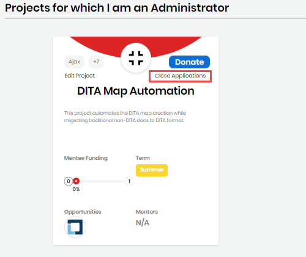

# Open or Close Mentorship Applications

As a project administrator, you can open or close mentorship applications for a project. When you close applications, the Apply button on a project becomes unavailable so mentees cannot apply. When you open applications, the Apply button becomes available.

**Do these steps:**

1. Log in to your account.
2. Go to your account and select **My Projects** from the drop-down list.
3. On the **project** for which you want to open or close mentorship applications, click the toggle link: **Open Applications**/**Close Applications**.

