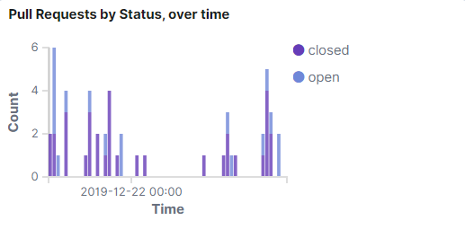
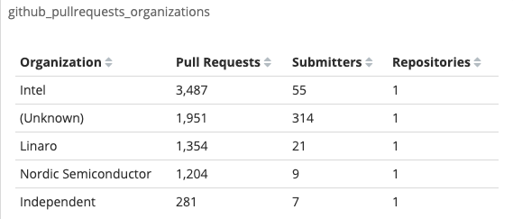

# Analyze GitHub Pull Requests


Roles: Developers, Community Managers

Where: GitHub PRs dashboards are available from the **Code** drop-down list.


Dev Analytics lets you look at the pull request contributions to the project and answer questions such as:

* Who contributes to the community by submitting pull requests?
* How responsive is the project to changes?
* Who does the bulk of the work?
* What organizations submit pull requests for the project?

**Follow these steps:**

1. Click a **project name** of interest that shows the GitHub logo.
2. From the **Code** drop-down list, select **GitHub PRs** &gt; **PR Overview**.

   A dashboard shows information about pull requests for a project and organization, and information about who submitted the pull request and when:GitHub PRs &gt; PR Overview

   **PRs** shows the total number of Pull Requests, Submitters, and Repositories.

   **Pull Requests by Status, over time** shows a stacked bar graph that represents the number of open and closed pull requests over time. Mouse over a color in the graph to see the total number of pull requests by the status that occurred on a date.

   **Submitters, over time** shows a bar graph that represents the number of pull request submitters over time. Mouse over a color in the graph to see the total number of submitters that occurred on a date.

   **Submitters** shows a table that lets you sort values by Submitter, Pull Requests, Repositories, and Avg. Open Days.

   **Submitters by Organization** shows a doughnut chart that represents the total number of submitters by each organization. Mouse over a color \(organization\) in the chart to see the organization name, total number of submitters, and the percentage of the project's submitters.

   **Projects** shows a table that lets you sort values by Project, Pull Requests, Submitters, and Repositories. 

   **Pull Request by Organization, over time** shows a stacked bar graph that represents the number of pull requests by organization over time. Mouse over a color in the graph to see the total number of pull requests that occurred on a date for the organization.

   **github\_pullrequests\_organizations** shows a table that lets you sort values by Organization, Pull Requests, Submitters, and Repositories.

   **Repositories** shows a table that lets you sort values by Repository, Pull Requests, Authors, Assignees, and Labels. You can select a repository to view its details in GitHub.

3. Use the visualizations to understand the project activity and other aspects of the pull requests:

   As a developer, you can see how active a project is and the average duration that pull requests remain open. In **Pull Request by Status, over time**, you note a recurring pattern of pull requests that remain open too long within a certain time frame. The length of time pull requests remain open can indicate how responsive and welcoming your project maintainers are to outside contributors. If a pull request sits for too long without response, potential contributors may go to other projects. In addition, pull request metrics depend on the size of the project. Small projects might keep the number of open pull requests at 10 or fewer. Keeping pull requests at this limit would be challenging for large projects that have lots of community input compared to the number of maintainers. Reviewing pull requests takes time so large projects tend to have longer open durations than small projects. This data helps you decide if this is a project in which you want to spend your time.

As a project maintainer, you can see the number of pull requests by submitters, organizations, and repositories. In **github\_pullrequests\_organizations**, you look for the organization that is doing the bulk of the development effort.

