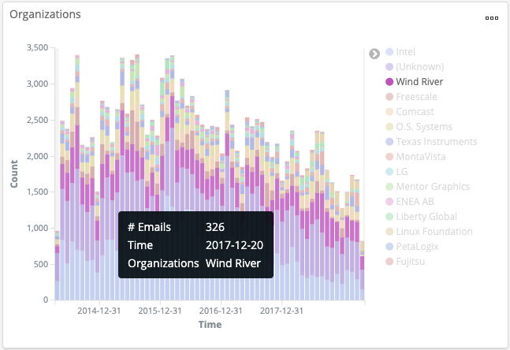

# View Mailing List Activity


Roles: Developer, Community Manager, Project Manager

Where: Mailing List dashboards are available from the **Community** drop-down list.


A mailing list is a common way for project community members to interact with others in a project. Mailing lists are often set up so that all members can send to the list. Members can ask questions and get help or provide information to others on the list. A busy mailing list can be a good indicator of the health of community engagement in the project. 

**Do these steps:**

1. Click a **project name** of interest.
2. From the **Community** drop-down list, select **Mailing List** &gt; **Overview**.  
   A dashboard shows information about email activity in projects and who sent emails and when. Information about the corresponding organization is also provided.Mailing List &gt; Overview

   **mbox** shows the total \# Emails, \# Email Senders, and \# Mailing Lists.

   **Emails** shows a bar graph that represents the number of emails over time. Mouse over a color in the graph to see the total number of emails for a date.

   **Email Senders** shows a bar graph that represents the number of emails per day overtime. Mouse over a color in the graph to see the total number of email senders for a date.

   **Organizations** shows a doughnut chart that represents the total number of emails by each organization. Mouse over a color \(organization\) in the chart to see the organization name, total number of emails, and the percentage of the project's emails.

   **Projects** shows a table that lets you sort values by Project, \# Emails and \# Senders. 

   **Email Senders** shows a table that lets you sort values by Email Sender, \# Emails, \# Projects, \# Mailing Lists, and Avg. Characters. 

   **Organizations** shows a stacked bar graph that represents the number of emails by organization over time. Mouse over a color in the graph to see the total number of emails for the organization and the date.

   **Emails by Time Zone** shows a bar graph with a count of emails per Coordinated Universal Time \(UTC\) time zone. Dates and times use the time zone of the computer where the sender mailed the email. This data is used to display time zone information. Mouse over a color in the graph to see the total number of emails for each time zone.

   **Mailing Lists** shows a table that lets you sort values by Mailing List, \# Emails, \# Senders, and \# Organizations.

3. Use the visualizations to understand aspects of mailing list activities for the project. Any conversation or discussion in a mailing list can be helpful to a project by solving bugs or even providing potential seeds for new features, new products, and so on. For example, you might be interested how active an organization's mailing list is—look at the analytics for the organization such as the **Organizations** stacked bar graph:  In another example, you hold in high esteem a community member and want to see if this person participates actively in the project—look at the **Email Senders** analytics. 

