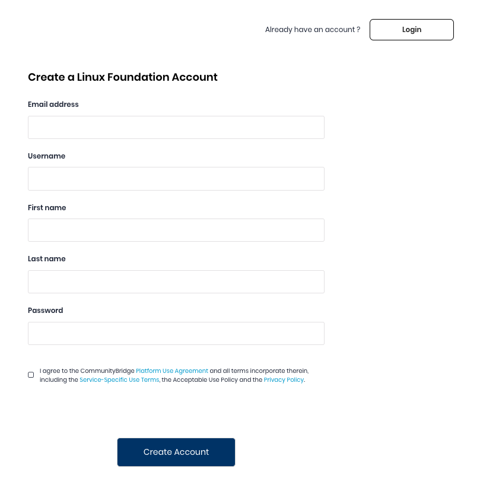

# Create a Linux Foundation Account

You can create a Linux Foundation account to sign in to CommunityBridge. CommunityBridge uses your Linux Foundation identity \(account settings\) for authentication.

**Do these steps:**

1. Go to [https://funding.communitybridge.org/](https://funding.communitybridge.org/) or [https://people.communitybridge.org/](https://people.communitybridge.org/)and click **Log In**. **Result:** Log in window appears.
2. Click **Create Account**. 
3. Complete the fields and accept the Terms of use and Privacy Policy. Click **Create Account**.    **Result:** An email notification is sent to the email address that you have provided for creating your account.
4. Go to your email inbox and open the email that you received from Linux Foundation ID.
5. Click **Confirm my email**.
6. Continue to your account.

