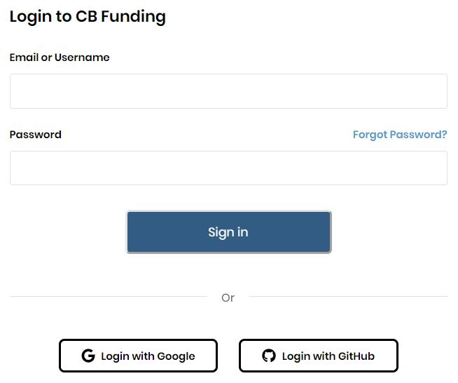
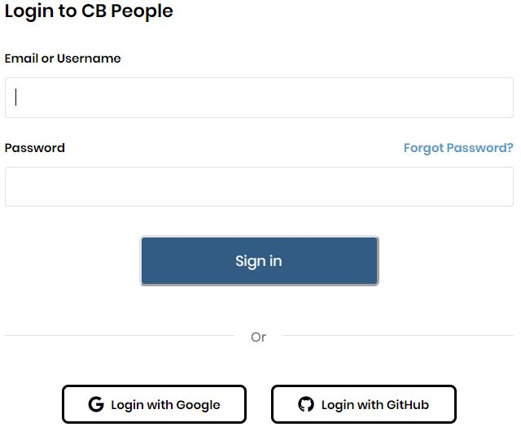

# Login to CommunityBridge

You can use your Linux Foundation credentials to log in to CommunityBridge. 

**Do these steps:**

1. **For Funding:** Go to [https://funding.communitybridge.org/](https://funding.communitybridge.org/) and click **Log In**. **For Mentorship:** Go to [https://people.communitybridge.org/](https://people.communitybridge.org/) and click **Log In**. Login to CB Funding \(for Funding \)/ Login to CB People \(for Mentorship\) Log in window appears:      
2. Enter your credentials and click **Log In**. CommunityBridge Funding or CommunityBridge Mentorship home page appears. If you forgot your password, you can reset it anytime. For details, see [Reset Password](../reset-password.md).

See:

* [Login with Google](login-with-google.md)
* [Login with GitHub](login-with-github.md)

