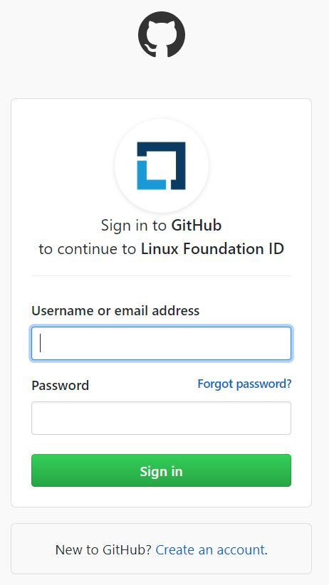

# Login with GitHub

You can log in to CommunityBridge using your GitHub credentials. Your GitHub credentials authenticate your CommunityBridge account.

**Do these steps:**

1. Go to [https://funding.communitybridge.org/](https://funding.communitybridge.org/) or  [https://people.communitybridge.org/](https://people.communitybridge.org/), and click **Log In**. **Result:** Log In page appears.
2. Click **Login with GitHub**. The Sign in to GitHub page appears.  
3. Enter your GitHub user credentials and click **Sign in**. **Result:** The CommunityBridge Funding/Mentorship home page appears.

