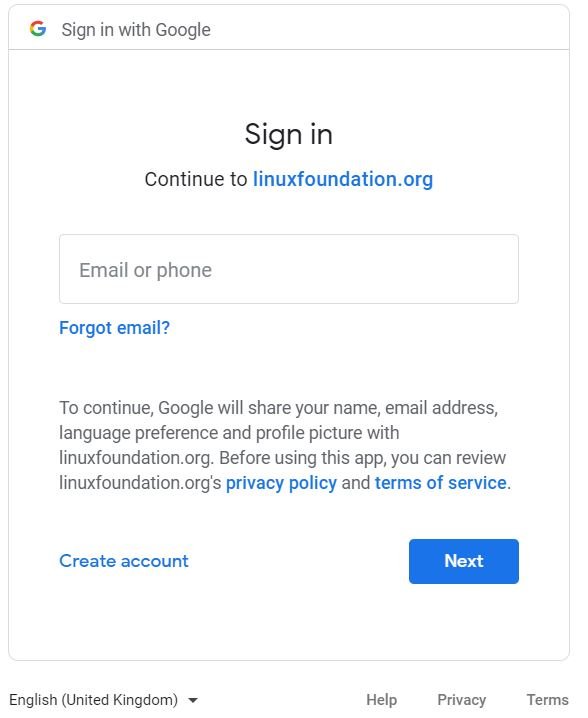

# Login with Google

You can use your Google account credentials to log in to CommunityBridge. Your credentials are used to authenticate your Google account.

**Do these steps:**

1. Go to  [https://funding.communitybridge.org/](https://funding.communitybridge.org/) or  [https://people.communitybridge.org/](https://people.communitybridge.org/) and click **Log In**. **Result:** Login page appears.
2. Click **Login with Google**. The Sign in with Google page appears.   
3. Provide email address and click **Next**.
4. Provide password and click **Next**. **Result:** CommunityBridge home page appears. **Note:** If you do not have a Linux Foundation account, the Create an account page appears.  
5. Enter a username and agree to CommunityBridge Platform Use Agreement and terms.
6. Click **Create Account**.

