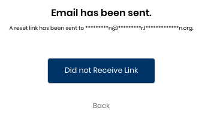

# Reset Password

If you do not remember your Linux Foundation login password or need to reset it, you can make a request to get your password reset. A password change invalidates any of your CommunityBridge sessions and you must sign in again.

**Do these steps:**

1. On the Sign in page, click **Forgot Password? Result:** The Forgot your password? page appears. 
2. Enter your username or email address and click **Reset Password**.  
3. Check your email inbox for an `CommunityBridge: Reset Password` email and open it.
4. Click **Reset Password**.
5. Enter your new password and confirm it in the Change Password page. Click **Submit**.   The status bar confirms that your password is updated.

