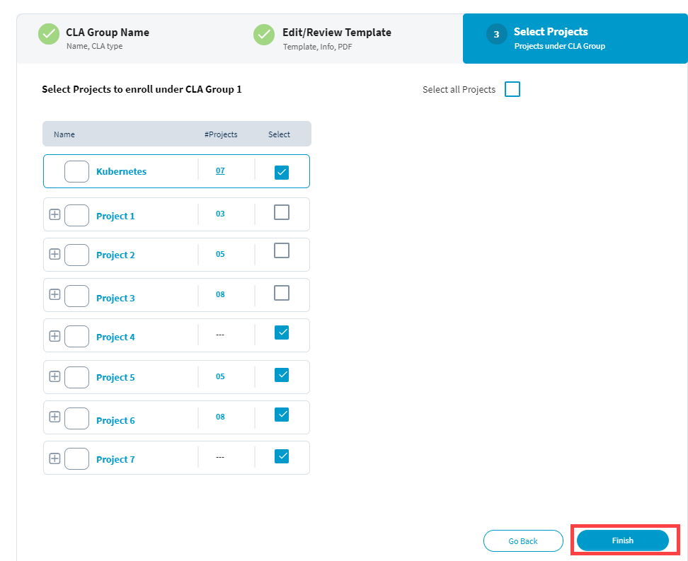

# Configuring CLA for a Foundation

A Foundation, also called Group of Projects, is a project that has sub projects under it. As a project manager or an administrator, you can configure CLA for a foundation or a sub project under the foundation. For foundations such as CNCF, you configure CLA for the foundation, and it is applicable to all the sub projects that come under the foundation.

You can configure CLA group for a group of projects or individual projects. CLA groups are individual and/or corporate CLAs required for contribution to a project repository. A CLA group can be applied to a single repository, a group of repositories of a project,  an entire group of projects where each repository has its own repository set.

**To Configure CLA for a Foundation \(Group of Projects\):**

 1. On the Foundation page, click **Add new CLA Group**.  
     New CLA Group window appears.

2. Under **CLA Group Name** tab, provide a CLA group name, and short description in the respective fields.  
**Note:** Mouse over the help icons to know more about the respective fields.

3. Select type of check boxes that you want to implement for the contributors of the project.  
**Note:** A warning message appears if you select only one check box. Click the help icons next to fields or check boxes to know more.

4. Click **Next**.  
**Result: Edit/Review** tab appears. If you click **Go Back**, you will lose the details that you have entered.

5. Under **Edit/Review Template** tab, you will see ICLA and/or CCLA templates based on your selection of check boxes from CLA Group Name tab.

6. For a template type, provide full name of the project, and email address of the person in the respective fields as shown in the following screen:

7. Click Review CCLA/ICLA Template, review the templates, and click **Approve Template & Download**.  
**Result:** **Select Projects** tab appears. Click **Go Back** to go back to the **CLA Group Name** screen.

8. Under **Select Projects** tab, select projects that you want to enroll under the CLA group, and click **Finish**.  
**Note:** Select the check box to select all the projects at a time. Click **Go Back** to go back to the **Edit/Review Template** screen.

The CLA groups are created for a foundation. You can [view CLA group and activity log statuses](view-cla-and-activity-log-status.md). 

  

