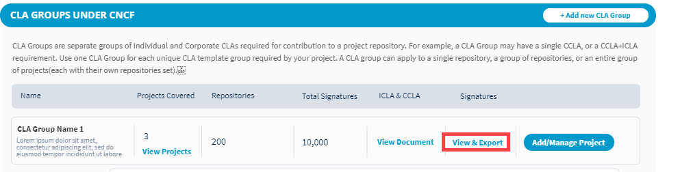
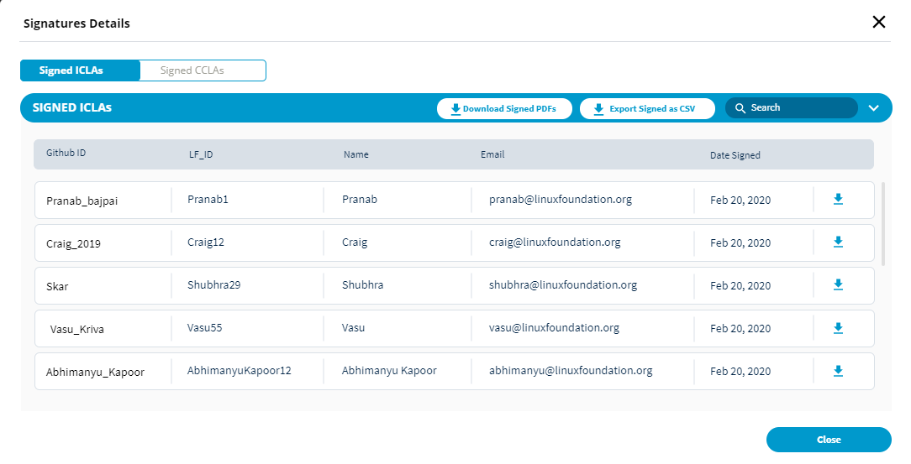

# View and Manage CLA Signatures\(working\)

As a project manager, you use the CLA Admin Dashboard to manage your CLA group details, and view user signatures and companies.

**Do these steps:**

1. [Sign in](../easycla/project-managers/sign-in-to-the-admin-console.md).
2. Click a **project** of interest.

   The project page appears.

3. Under the project, go to a CLA group for which you want to view the signatures, and click **View & Export** under the **Signatures** column.

1. Do any of the following actions:
   * [Change Your Current CLA Type Selections](../easycla/project-managers/manage-cla-group-details.md#change-your-current-cla-type-selections)
   * [View CLA User Signatures](../easycla/project-managers/manage-cla-group-details.md#view-cla-user-signatures)
   * [View the Corporate CLA Companies](../easycla/project-managers/manage-cla-group-details.md#view-the-corporate-cla-companies)

## View Individual CLA User Signatures 

1. A signature list shows details about who signed a CLA for your project.

**Signed ICLAs** shows a table that displays the following information:

* **GitHub ID** shows the GitHub identity of the individual contributor.
* **LFID** shows the Linux Foundation identity of the individual contributor.
* **Name** identifies the individual who signed the CLA.
* **Email** shows the email address of the individual who signed the CLA
* **Date Signed** shows the date that the individual, employee, or CLA signatory signed the CLA.

2. \(Optional\) Click the **Date Signed** column header to sort the table values in ascending or descending order. Use the pagination options to go to subsequent or previous pages.

3. Click **Close** to close the window.

## View Corporate CLA User Signatures 

The Corporate CLA list lets you see what companies in your project have a signed Corporate CLA. You can view the full set of signatures and list of approved contributors who are interacting with the project.

1. Click **Signed CCLAs** tab.  
All companies that have signed the Corporate CLA are listed.

**Signed CCLAs** shows a table that displays the following information:

* **Add Manually Signed CCLA** lets you add a Corporate CLA document that a company has signed. **\(CHECK WITH PRANAB\)**
* **Company** shows the name and logo of the company that the CLA Manager belongs to.
* CLA Manager\(s\) name: **MODIFY THE CONTENT AFTER PRANAB UPDATES THE PRD.**
* **Approval Criteria** - When user clicks on "View Details" the table expands to show approved list. This is shown in step 3c.2
* Approved Contributor - Gives the names of approved contributors from that company. This is shows in step 3c.2\
* **Date Signed** shows the date when CLA Manager signed the CCLA.
* **Signed CLA:** Click   to download the CLA document. **\(CHECK WITH THE UI FLOW\)**

2. \(Optional\) Click the **Date Signed** column header to sort the table values in ascending or descending order. Use the pagination options to go to subsequent or previous pages.

3. Click **Close** to close the window.

