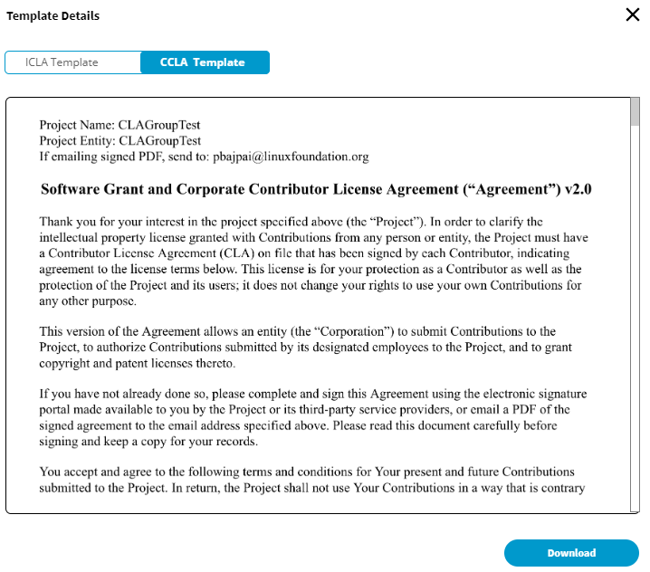

# View CLA Group and Activity Log Statuses

### CLA Group created with projects

After you [configure CLA](configuring-cla-for-a-foundation.md), the CLA groups that are created for a group of projects or an individual project are shown under **CLA GROUPS UNDER &lt;FOUNDATION/PROJECT&gt;**, and following screen appears showing all the details for the created CLA groups.

For a CLA group, following details are shown:

* **Name:** Shows the name and description of the CLA group
* **Projects Covered:** Shows the total number of projects that are covered under the CLA group. Click **View Projects** to see the projects under the CLA group with all the details.
* **Repositories:** Total number of repositories within the CLA group. Repository numbers are also shown per project within the CLA group.
* **Total Signatures:** Total number of individual and corporate contributors who have signed CLAs within the CLA group.
* **ICLA&CCLA: View Document** lets you view and download the CLA templates for the project.   
* **Signatures: View & Export** lets you view and download the names who have signed Individual CLA and Corporate CLA.   
* **Add/Manage Project:** lets you add or remove a project.
* **Add/Manage Repositories:** **NOT IN PRD YET, BUT SHOWS IN WIREFRAME**

**ACTIVITY LOG** shows recent activities for the project. Following are various entities of Activity Log table**:**

* **Date-Time** shows date and local time when activity happened.
* **Activity** shows what activity happened.
* **Performed By:**shows the name of the person who did certain activity.
* **Company Name** shows the company with which the performer is associated with.
* **Project** shows the project name for which the activity happened.

Click **Export Activity Log to CSV** to download the log in a `.csv` format.

### CLA group created without projects 

Following image shows when a CLA group is created for a group of projects with no projects selected under it. Click **Enroll Projects in CLA** to add projects to the CLA group.

