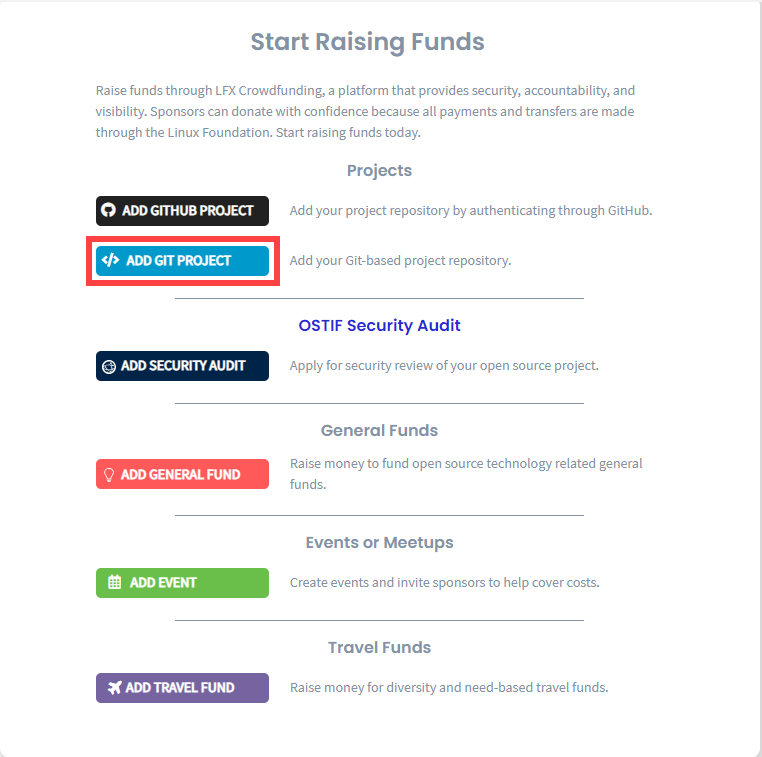

# Add a Git Project

As a project administrator, you can submit an application to CommunityBridge Funding by adding a Git-based open source project. Linux Foundation requires access to your code repository to support security vulnerability scanning.


Keep these items ready before you begin, although they are not required:

* The project ID for your [Core Infrastructure Initiative \(CII\) Badge Program](https://www.coreinfrastructure.org/programs/badge-program/) 
* The URL for your code of conduct \(the rules of behavior for the members of that group or organization\)
* A logo file that represents your project in JPG, PNG, SVG format with a maximum size of 2 MB
* A list of names and email addresses for the individuals who will benefit from working on the project


**Do these steps:**

1. [Sign in](../../../sso/sign-in/) to [CommunityBridge Funding](https://funding.communitybridge.org/).
2. Click **Apply and** Select **ADD GIT PROJECT.**    ****
3. Complete a project application form; red asterisks indicate required fields. For information about fields, see [Project Application Form](../project-application-form.md).

The Linux Foundation administrator will review and approve or reject the application. The Linux Foundation will set up the financial aspects of your project and contributors, such as Expensify accounts and a project expense policy.

**Note:** If you opt-in for Mentorship Goal, and complete the fields as per [Opt In Your Project to the Mentorship Program](../mentorship-program/opt-in-your-project-to-the-mentorship-program.md), then prospective mentors receive email notification to participate in the Mentorship program. After your project accepts mentees, [Set Up Stipends](../mentorship-program/set-up-a-stipend-for-a-mentee.md) for mentees.

Optional: Go to your user account and select **My Projects** to see your pending project.


You can edit your project at any time. Select the project you want to update and select **Edit Project.**


