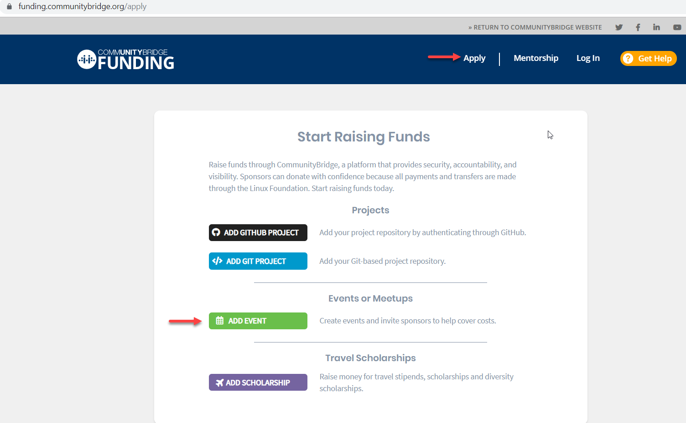

# Add an Event

As an event organizer, you can submit an application to add an Event fund to CommunityBridge Funding. For example, add an Event fund to pay for registration expenses for attendees at a women's technical meetup. In the application, invite people \(beneficiaries\) who you would like to attend or participate in the event and then be reimbursed for their related expenses. These beneficiaries will receive an invitation from Expensify \(an expense management application\) so that they can submit reimbursements for their expenses.


Have these items handy before you begin:

* A logo file that represents the event in JPG, PNG, SVG format with a maximum size of 2 MB
* A list of the names and email addresses for the individuals who you want to benefit from the fund


**Do these steps:**

1. [Log in](../../../sso/sign-in/) to [CommunityBridge Funding](https://funding.communitybridge.org/).
2. Click **Apply** and select **ADD EVENT**. ****
3. Complete the application form. Red asterisks indicate required fields. A bar at the top of the page shows your progress as you click **Next** through the form. For information about fields, see [Event Application](../event-application.md).
4. Click **Submit Application**. The Linux Foundation administrator will review and approve or reject the application.
5. \(Optional\) Go to your user account and select **My Projects** to see your event pending for approval.    **Note:** You can edit your event at any time. Select the event that you want to update and click **Edit Event**.

