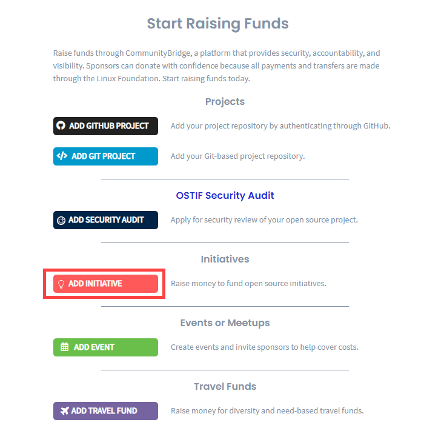

# Add Initiatives

You can submit an application to raise funds for any initiative for a open source project. In the application, add individuals' \(beneficiaries\) details who you want to sponsor. These beneficiaries will receive an invitation to Expensify \(an expense management application\) so that they can submit reimbursements for their travel expenses.


Keep these items ready before you begin:

* A logo file that represents your organization in JPG, PNG, SVG format with a maximum size of 2 MB
* A list of names and email addresses for the individuals who you want to benefit from the fund


### To add an Initiative:

1. [Sign in](../../../sso/sign-in/) to [CommunityBridge Funding](https://funding.communitybridge.org/).
2. Click **Apply** and select **ADD INITIATIVE**.   
3. Complete the application form. Red asterisks indicate required fields. For information about fields, see Initiative Application form.
4. Click **Submit Application.**

   The Linux Foundation administrator will review and approve or reject the application. The Linux Foundation will set up the financial aspects of your project and contributors, such as Expensify accounts and a project expense policy.

5. \(Optional\) Go to your user account and select **My Projects** to see your pending project.


You can edit your project at any time. Select the project you want to update and select **Edit Project.**


  

