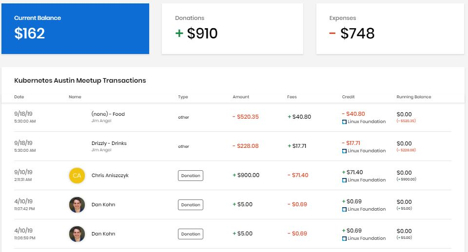

# Events

You can find out about events and donate to the ones that you want to support. You can register for an event that you want to attend, and possibly be reimbursed for expenses such as the registration fee. A Dashboard shows high-level information about funding such as how funds are distributed and what the funding goals are. CommunityBridge Funding also maintains and displays a transparent ledger of incoming funds \(backer and sponsor transactions\) and outgoing funds \(developer invoices, expenses paid, and so on\) for each event. The Financial tab lists all these transactions with details so that the entire community can view receipts of expenses.

**To View an Event:**

1. Open [CommunityBridge Funding](https://funding.communitybridge.org/).
2. Select **Events**.
3. Click an **event** of your interest.
4. Browse Dashboard for more information. Click the **Financial** tab to see transaction details. **Note:** The Home screen shows the overview of the project
   * [Overview](events.md#Events-Overview)
   * [Dashboard](events.md#Events-Dashboard)
   * [Financial](events.md#Events-Financial)

## Overview 

The overview shows some or all of the following items depending on the data that is available:

A bar shows the donation progress towards the total goal.

| Name  | Description |
| :--- | :--- |
| **View Website** | Opens the associated website. |
| **Location** | The location of the event.. |
| **Dates** | The start date and end date of the event. |
| **Register** | Lets you register for the event. |
| **Sponsor** | Lets you donate to the event. |
| **Current Balance** | The total amount of funds available in the account. |
| **Backers** | The number of individuals who have donated to the event. This number includes individual and organization donations by unique Linux Foundation accounts. The number of backers can indicate the popularity and momentum of the event. |
| **Sponsor Organizations** | The logos of companies that sponsor the project. |
| **Sponsorships** | The logos for the types of sponsorships. |

  
View an example of an event overview section:

## Dashboard 

Dashboard shows various aspects of the event.

| Name | Description |
| :--- | :--- |
| **Current Balance** | The total amount of funds available in the account. |
| **Donations** | The amount of money that has been donated to the project. |
| **Expenses** | The amount of money spent or costs incurred for the project, which indicate the cost of doing business. |
| **Event Sponsorship Distribution** | Shows how the event funds are distributed and their dollar amount. |
| **Goals Breakdown** | The financial goal and progress towards it by individual goal. |
| **Recent Transactions** | Lists recorded financial transactions in chronological order. Click **View all transactions** to see a log of transactions. |

  
View an example of an event dashboard section:

## Financial 

The Financial tab lists all transactions with details in chronological order.

View an example of a financial tab section:

