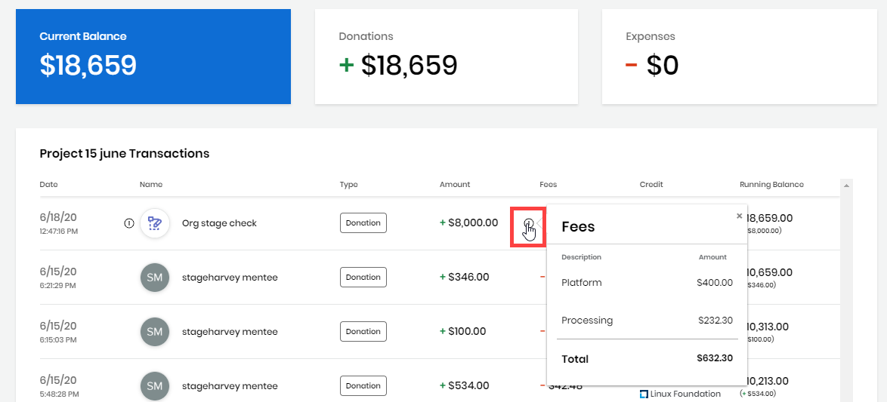

# Projects

Projects page indicates how active a project is in the open source community. This information can help you decide what particular open source project to participate in or fund. You can also learn about the financial aspects of a project, view how funds are distributed and what the funding goals are. CommunityBridge Funding maintains and displays a transparent ledger of incoming funds \(backer and sponsor transactions\) and outgoing funds \(developer invoices, expenses paid, and so on\) for each project. The Financial tab of a project page lists all these transactions with details so that the entire community can view receipts of expenses.

**To view project details:**

1. Open [CommunityBridge Funding](https://funding.communitybridge.org/).
2. From **Projects** tab, Click a **project** of interest. The landing page shows overview of the project.
3. Browse Dashboard for information. Click the **Financial** tab to see transaction details. **Note:** The Home screen shows the overview of the project.
   * [Overview](projects.md#ProjectsandMentorships-Overview)
   * [Dashboard](projects.md#dashboard)
   * [Financial](projects.md#ProjectsandMentorships-Financial)

## Overview 

The overview shows some or all of the following items depending on the data that is available:

<table>
  <thead>
    <tr>
      <th style="text-align:left">Name</th>
      <th style="text-align:left">Description</th>
    </tr>
  </thead>
  <tbody>
    <tr>
      <td style="text-align:left"><b>forks</b>
      </td>
      <td style="text-align:left">The number of repository copies. Forking a repository lets developers
        propose changes to another project or use another project as a starting
        point for an idea.</td>
    </tr>
    <tr>
      <td style="text-align:left"><b>stars</b>
      </td>
      <td style="text-align:left">The number of developers who saved the project repository to their list
        of Starred Repos.
         Stars indicate popularity in that developers like or want to follow a
        repository.</td>
    </tr>
    <tr>
      <td style="text-align:left"><b>issues</b>
      </td>
      <td style="text-align:left">The number of bugs, enhancements, or other requests in a repository. The
        number of issues can indicate the activity in a project.</td>
    </tr>
    <tr>
      <td style="text-align:left"><b>Donate</b>
      </td>
      <td style="text-align:left">Click <b>Donate </b>to <a href="../donate-sponsor/">donate</a> to the project.</td>
    </tr>
    <tr>
      <td style="text-align:left"><b>Current Balance</b>
      </td>
      <td style="text-align:left">The total amount of funds available in the account.</td>
    </tr>
    <tr>
      <td style="text-align:left"><b>Sponsor Organizations</b>
      </td>
      <td style="text-align:left">The logos of companies that sponsor the project.</td>
    </tr>
    <tr>
      <td style="text-align:left"><b>View Repository</b>
      </td>
      <td style="text-align:left">Opens the project repository in GitHub.</td>
    </tr>
    <tr>
      <td style="text-align:left"><b>View Site</b>
      </td>
      <td style="text-align:left">Opens the associated website.</td>
    </tr>
    <tr>
      <td style="text-align:left"><b>CII badge field</b> 
        
      </td>
      <td style="text-align:left">
        <ul>
          <li>Shows that the project is a participant in the <a href="https://www.coreinfrastructure.org/programs/badge-program/">Core Infrastructure Initiative (CII) Badge Program</a>.</li>
          <li>The color of the badge represents the CII status.</li>
          <li>The status is a &quot;tiered %&quot; field&#x2014;the field shows 300%
            for gold, 200% for silver, and 100% for passing, and adds progress after
            the highest-earned badge.</li>
          <li>A CII badge indicates that the project has self-certified that they follow
            best practices for secure open source development.</li>
          <li>Click the <b>badge field</b> to go the project&apos;s CII Best Practices
            page and view the CII details.</li>
        </ul>
      </td>
    </tr>
    <tr>
      <td style="text-align:left"><b>Code of Conduct</b>
      </td>
      <td style="text-align:left">
        <ul>
          <li>Shows the rules of behavior for the project.</li>
          <li>The Code of Conduct (CoC) identifies the standard behavior expected of
            their community &#x2014; and to protect those involved. A default <a href="https://www.contributor-covenant.org/version/1/4/code-of-conduct">Code of Conduct</a> opens
            when a project does not provide a specific one.</li>
        </ul>
      </td>
    </tr>
  </tbody>
</table>

  
Following is an example of a project overview section:

## Dashboard

Dashboard shows various aspects of the project.

| Name | Description |
| :--- | :--- |
| **Current Balance** | The total amount of funds available in the account. |
| **Donations** | The amount of money that has been donated to the project. |
| **Expenses** | The amount of money spent or costs incurred for the project, which indicate the cost of doing business. |
| **Project Funding Distribution** | Shows how project funds are distributed and their dollar amount |
| **Goals Breakdown** | Shows the annual financial goal and progress towards it by individual goal. |
| Stacks |  |
| Vulnerability Report |  |
| Mentorship Program |  |
| **Recent Transactions** | Lists recorded financial transactions in chronological order.  Click **View all transactions** to see a log of transactions. |

Funding integrates with independent CommunityBridge services:

* Vulnerability Detection
* Stacks
* Bug Bounty \(not shown in the following example\)

You can see additional information about the projects from the above mentioned the integrated services. For more information, see [Integrated Services for a Project](integrated-services-for-a-project.md).

## Financial 

The Financial tab lists all transactions with details in chronological order. Click the icon next to Fees to see the see distribution of applicable fees.

