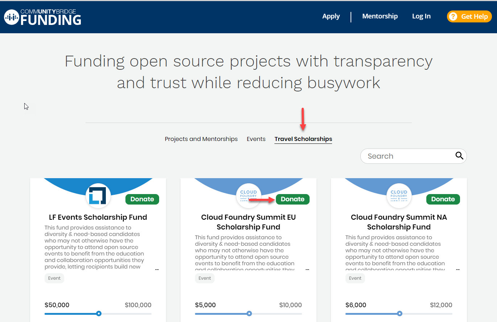

# Donate to Travel Scholarships

You can donate to Travel Scholarships, for example to raise funds for travel to a Linux Foundation technical summit. Specify how you want your donations to be used, and track expenses in transparent public ledgers.

**To donate to a Travel Scholarship:**

1. Open [CommunityBridge Funding](https://funding.communitybridge.org/) and select **Travel Scholarships.**
2. Click **Donate** on a Travel Scholarship of interest.  You are prompted to log in if you have not already done so. The New Donation form appears. 
3. Select **Individual** or **Organization.** You can [add, edit, or delete an organization.](donate-as-a-project-sponsor/add-edit-or-delete-an-organization.md)
4. Click in the **I want to give** field and type a dollar amount or select a predefined dollar option.
5. Select a donation frequency option: **One-time** or **Monthly.**

   * If you select **Monthly**, you will be billed on a recurring basis that is on the first calendar day of each month. You can cancel your recurring donation by logging into your account and changing your donation settings or by contacting us at [admin@communitybridge.org](mailto:admin@communitybridge.org).

   **Recurring donations:**

   If you choose to donate on a monthly basis, you will be billed upon submitting the donation, and will continue to be billed on the first calendar day of each subsequent month thereafter, until you choose to stop the recurring donation. By electing to donate on a recurring basis, you acknowledge that your donation will automatically renew and have a recurring payment feature, and that unless and until you opt out of the auto-renewal of the recurring donation, which can be done through the CommunityBridge Funding service, any recurring donation you have signed up for will be automatically renewed for successive renewal periods of the same duration as the initial term originally selected. In connection with each of your recurring donations, you authorize The Linux Foundation and/or its third-party payment processors to charge your payment method in the amount of the applicable recurring donation and any taxes, fees or other charges. You may cancel your recurring donation by logging into your account and changing your donation settings or by contacting us at [admin@communitybridge.org](mailto:admin@communitybridge.org).

6. \(Optional\) In the **Donation allocation** drop-down list, select a goal for your donation to support.  The organizers can adjust fund allocations as per their choice, and may not use the funds per your requested allocation. If you have a strict fund allocation target, please contact your Linux Foundation administrator.
7. For Payment Method, select **Credit or debit card** or **Invoice.**
   * The **Invoice** Payment Method is enabled only if you donate as an **Organization** and select **One-time**.
   * **Credit or debit card** lets you add a default card or edit a default card to use for your donation payment. Click **Add Card** or **Edit Card** to add or edit a card, respectively. Enter your card details and click **Submit**.
   * **Invoice** lets you request an invoice from the Linux Foundation for your donation. Select **Invoice**. If you have a purchase order number, enter the number in the PO Number field that appears. If you want to request a purchase order number, contact your Linux Foundation administrator—the Finance team will contact you. The Finance team can work with your organization for other methods of payment such as checks.
8. Review your donation summary and your donation amounts in the **Review Donation** section. Notice the fee amounts and the amount that Linux Foundation waives.
9. Select the checkbox— **I agree to the CommunityBridge** [**Platform Use Agreement**](https://communitybridge.dev.platform.linuxfoundation.org/platform-use-agreement) **and all terms incorporated therein, including the** [**Service-Specific Use Terms**](https://communitybridge.dev.platform.linuxfoundation.org/service-terms)**, the** [**Acceptable Use Policy** ](https://communitybridge.dev.platform.linuxfoundation.org/acceptable-use)**and the** [**Privacy Policy**](https://www.linuxfoundation.org/privacy/).
10. Click **Submit Donation** or **Submit Subscription,** depending on your donation selection.  **Result:** Your Account page appears.


At any time, you can go to your user account and select **My Transactions** to edit your monthly donation amount—click **Edit monthly donation** on the group of interest.


