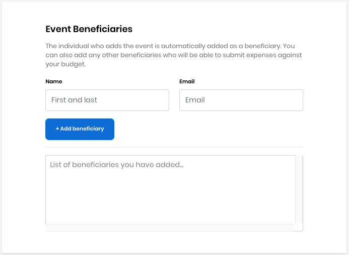

# Event Application

## Event Details 

The following table lists all the fields in the **Event Details** panel of the Event Application:

| Field Name | Description |
| :--- | :--- |
| **Event name** | \(Required\) The name of your event fund. This name will appear on your Funding event page. **Note:** This name must be unique—no other project can exist in Funding with the same name. However, funds of a different type can use the same name. For example, an Event fund and a Project fund can use the same name. |
| **Topic** | \(Required\) Type of industry that relates to your event. Click **+Add topic**  after you select a category from the list. **Note:** The topics/topics are reflected in the **List of topics you have added...** field after you add a topic. |
| **Elevator pitch**  | \(Required\) Brief statement of why your project is important to support. |
| **Event Summary** | \(Required\) A brief description about your event. |
| **Website URL** | \(Optional\) The Website address that you want to associate with the event funding. |
| **Registration URL** | \(Required\) The specific URL where people can register or sign-up for your event. |
| **Start Date** | \(Required\) Start date of your event. Click the calendar icon to select date. |
| **End Date** | \(Required\) End date of your event. Click the calendar icon to select date. |

## Event Location 

The following table lists all the fields in the **Event Location** panel of the Event Application:

| Field Name | Description |
| :--- | :--- |
| **City** | City name where the event is to be conducted. |
| **Country** | Country name where the event is to be conducted. |

## Event Branding 

The following table lists all the fields in the **Event Branding** panel of the Event Application:

| Field Name | Description |
| :--- | :--- |
| **Event Logo** | \(Optional\) A symbol or other design adopted by your organization that identifies your project. Click **Browse** to upload a file. Preview shows the logo that you uploaded. **Note:**  File type- JPG, PNG, SVG             File size- 2MB \(maximum\) |
| **Accent Color** | \(Required\) The hexadecimal number for the color that you want to use as your project brand, for example, \#008000 is green. Enter a **hexadecimal number** or click in the field to open the color picker. Use the picker by clicking inside the color field to pick a color. You can use the up/down arrows to refine the color by editing the color values. The gray field refreshes to match your selection. |

## Event Beneficiaries 

Event Beneficiaries are individuals who are involved with the event and who can benefit from the fund.

| Name | Description |
| :--- | :--- |
| **Name** | Name of the person who you want to designate as a beneficiary of funds. |
| **Email** | Email of the person who you want to designate as a beneficiary of funds. |

After you enter the name and email address of the beneficiaries, click **+Add beneficiary** to add the person to the list. To add more beneficiaries, click **+ Add beneficiary** and complete the fields that appear.

After the application is approved, the Linux Foundation finance team sets up an individual Expensify account for each beneficiary. Each beneficiary receives an email notification from the finance team that includes a link to their Expensify account. Beneficiaries are invited to join the custom Expensify policy as part of their participation in CommunityBridge. After accepting the invitation, beneficiaries have access to the policy where they can submit expenses for [reimbursement](get-reimbursed.md) from CommunityBridge funds.

The finance team also works with project administrator to set up a specific expense policy that applies to the fund. All the beneficiary and fund expenses are gated through the expense policy. For example, the policy might state a hotel price range that is acceptable for beneficiaries or a per diem food allowance. 

Only the project administrator can add or remove beneficiaries. The finance team is notified and adjusts the Expensify accounts accordingly.

## Event Budget 

**Sponsorship Goal** is a total funding goal amount for the year. The amount is a sum of the individual goal amounts.


Any funds remaining at year end can be carried forward to the next year.


## Fund Distribution 

**Fund Distribution** enables goals for how you want to distribute funds for your event, and complete the fields that appear—see the example below. Enter a percentage of your total sponsorship goal amount to designate towards the goal. You can use the up/down arrows to select a percentage also.

Be clear to potential sponsors about how you intend to use the funds. You can designate funds towards different types of expenses such as Venue and Travel. Goal amounts are targets not limits, so you can continue raising money beyond your goal amount. As you see progress in one or more goals, you can \(and should\) update the goals to reflect how you plan to utilize these additional funds.

## Event Funding Goal\(s\) \(Optional\) 

If you want to add custom goals for your event, click **Add Event Goal** and complete the fields that appear. These goals can include an all-attendee reception at a separate venue or the funds needed to bring in a featured guest speaker.

You can click **Delete** next to **Custom Goal** to delete any custom goal that you have added.

The following table lists all the fields in the **Custom Goal** panel of the Event Application.

| Field Name | Description |
| :--- | :--- |
| **Goal Name** | Name of your goal |
| **Goal Description** | A brief description about your goal |
| **Goal Color** | Hexadecimal number for the color that you want your event goal to use, for example, \#008000 is green. Enter a **hexadecimal number** or click in the field to open the color picker. Use the picker by clicking inside the color field to pick a color. You can use the up/down arrows to refine the color by editing the color values. The gray field refreshes to match your selection. |
| **Goal Icon** | A symbol or other design adopted by your organization that identifies your page. Click **Browse** to upload a file. Preview shows the logo that you uploaded. **Note:**  File type- JPG, PNG, SVG             File size- 2MB \(maximum\) |
| **Goal Allocation** | A percentage of the total goal amount that you want designated for this goal. |

## Event Sponsorship Tier\(s\) \(Optional\) 

You can offer your event sponsors different tiers of sponsorship. Each tier should have a unique name \(for example, "Platinum Sponsorship" or "Lunch Sponsorship"\) and tiers tend to have different benefits attached to them like a logo appearing on a website and signage, or being included in email announcements promoting the event. To add sponsorship tiers to your event, click **Add Sponsorship Tier** and complete the fields that appear.

The following table lists all the fields in the **Add Sponsorship Tier** panel:

<table>
  <thead>
    <tr>
      <th style="text-align:left">Field Name</th>
      <th style="text-align:left">Description</th>
    </tr>
  </thead>
  <tbody>
    <tr>
      <td style="text-align:left"><b>Tier name</b>
      </td>
      <td style="text-align:left">Name of your sponsorship tier. This name will appear on your Funding event
        page.</td>
    </tr>
    <tr>
      <td style="text-align:left"><b>Tier Description</b>
      </td>
      <td style="text-align:left">A brief description about your sponsorship tier.</td>
    </tr>
    <tr>
      <td style="text-align:left"><b>Tier Color</b>
      </td>
      <td style="text-align:left">
        
The hexadecimal number for the color that you want your event tier to
          use, for example, #008000 is green.

        
Enter a <b>hexadecimal number</b> or click in the field to open the color
          picker. Use the picker by clicking inside the color field to pick a color.
          You can use the up/down arrows to refine the color by editing the color
          values. The gray field refreshes to match your selection.

      </td>
    </tr>
    <tr>
      <td style="text-align:left"><b>Tier Icon</b> 
      </td>
      <td style="text-align:left">A symbol or other design adopted by your organization that identifies
        your project. Click <b>Browse</b> to upload a file. Preview shows the logo
        that you uploaded.
         <b>Note:  </b>File type- JPG, PNG, SVG
         File size- 2MB (maximum)</td>
    </tr>
    <tr>
      <td style="text-align:left"><b>Tier Minimum</b>
      </td>
      <td style="text-align:left">The minimum dollar amount that a sponsor can donate to the tier.</td>
    </tr>
  </tbody>
</table>

## Financial Summary 

The Financial Summary shows the annual financial goal and progress towards it by individual goal. A distributed report is shown based on your selection in the **Fund Distribution** section. 

## Terms and Conditions 

Read the Terms and Conditions, and click the checkbox.

