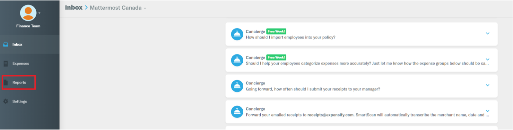
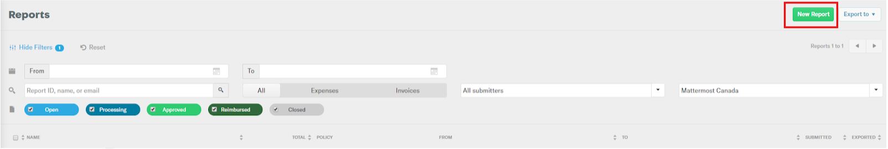
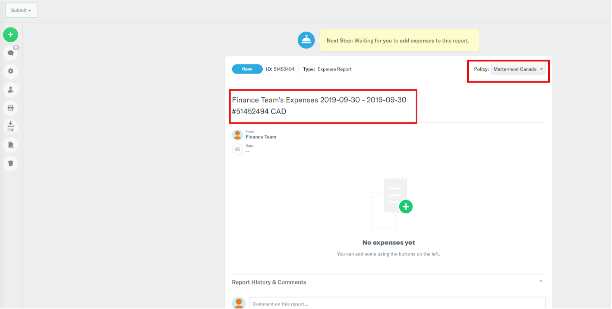

# How to Create Expensify Report

You can create an Expensify report by referring to either of the following method:

* Create the report before you incur expense and add the expenses as they arise. Or, 
* Consolidate all your expenses from your trip/event/onboarding and apply them to the report. 

#### To create a report:

1. Under you account, select **Reports** tab.

2. On **Reports** page, select **New Report** located in the top-right corner of your screen.  
**Result:** A report is displayed where you can add expenses. 

**Report Name** is generated automatically, and some fields, such as Name, Start and End dates, Report Number, and Currency, are auto-populated based on your profile information.

