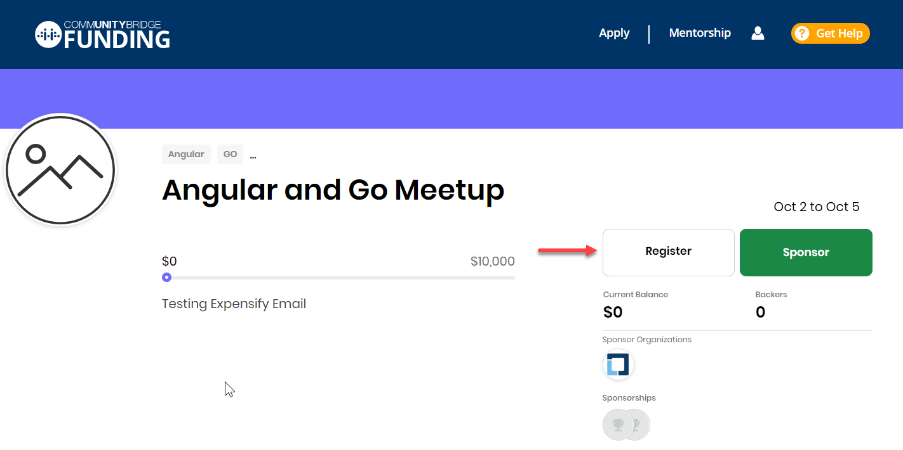

# Register for an Event

You can participate in an event to understand more about the project related information, and can socially involve with the entire community of the project.

**To Register for an event:** 

1. [Log in](../../sso/sign-in/) to [CommunityBridge Funding](https://funding.communitybridge.org/).
2. Under **Events** tab, select an event that you want to participate.  
3. Click **Register.**

