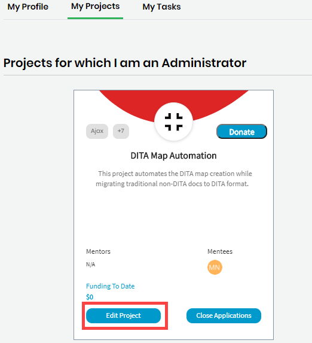

# Edit a Project

As a project administrator, you can edit your CommunityBridge Mentorship project.

**Follow these steps:**

 1. [Sign in](../../../sso/sign-in/) to [CommunityBridge Mentorship.](https://people.communitybridge.org/)

2. Go to your account and select **My Projects** from the drop-down list.  
  
  
An overview of each of your projects appears.

3. Under **Projects for which I am an Administrator**, click **Edit Project**.

4. Edit the [project application](enroll-your-project/mentorship-project-application.md) form and click **Submit**.

