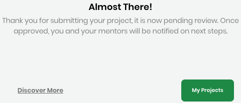

# Enroll Your Project

As the primary administrator of an open source project, you can enroll or add your project to CommunityBridge Mentorship program. After your project is approved, it is available in CommunityBridge Mentorship platform for Mentorship program participants.

The Linux Foundation reviews your project application and considers if your project:

* Is entirely an open source project
* Has sufficient indications of broad community usage
* Aligns to the Linux Foundation’s purposes for support of open source projects

The Linux Foundation notifies you when a decision is taken.

**To Enroll the Project:** 

Keep these items ready before you begin:

* The project ID for your [Core Infrastructure Initiative \(CII\) Badge Program](https://www.coreinfrastructure.org/programs/badge-program/)
*  A logo file in JPG, PNG, or SVG format that identifies your project
* The URL for your code of conduct \(the rules of behavior for the members of that group or organization\)
* A list of names and email addresses for the individuals who you want to invite as mentors

1. Log in to CommunityBridge Mentorship as a project administrator. For details, see [Login to CommunityBridge](../../../../sso/log-in-to-communitybridge/).

2. Click **Enroll Your Project**.

3. Complete the [Mentorship Project Application](mentorship-project-application.md) form fields. Red asterisks indicate required fields. A bar at the top of the page shows your progress as you click **Next** through the form.

4. Read and agree to the Terms and Conditions and **Submit** the application.  
An "Almost There!" message appears:

      **Note: My Projects** takes to your account &gt; My Projects

5. Look for a _CommunityBridge Team: Your project application for the CommunityBridge mentorship program is pending approval_ email in your Inbox.  
The email includes **View Project** option.


The Linux Foundation approves or rejects the application. You receive an email notification about the status of your application.


## Your Activities 

[Set Up a Stipend for a Mentee](../../../communitybridge-funding/mentorship-program/set-up-a-stipend-for-a-mentee.md)

[Open or Close Mentorship Applications](../open-or-close-mentorship-applications.md)

[Manage Your Mentorship Account](../manage-your-mentorship-account.md)

