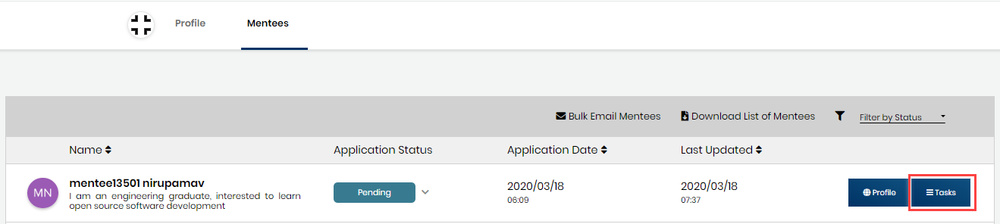

# Manage Mentee Tasks

A mentee applicant must have at least one application task to complete, for example an interview. When you enroll your project in Mentorship program, you select or define prerequisites that a mentee applicant must complete—these tasks appear in the Tasks view. This view lets you add and edit new tasks and update their statuses. 


[View profile of the mentee](view-mentee-profile.md) applicant to learn about their interests, skills, and see if they already working on other projects to help you  decide if they're a good fit. You can also [Contact a Mentee](contact-a-mentee.md) if you have questions.  


## **To Manage Mentee Tasks:** 

1. [Log in](../../user-profile/log-in-to-communitybridge/) to [CommunityBridge Mentorship.](https://people.communitybridge.org/)

2. Go to your account and select **My Projects** from the drop-down list.  
  
  
An overview of each of your projects appears.

3. Click a project for which you want to manage mentee application.

4. Navigate to **Mentees** tab. 

5. For a mentee, select **Tasks** on the mentee application page.

2. \(Optional\) Filter the list by selecting a value from the Term, Status, or Sort By drop-down lists.

3. Update a task by doing any of the following actions:

### **Change Status:**

Select a value from the **Status** drop-down list: In Progress, Submitted, Completed.  
When you update a task, the mentee receives an email informing them that the task is updated.

**Note:** Mentees can also change status of a task to either In Progress or Submitted by navigating to their accounts.If Mentees change status, the same status also reflects for you.

Following table describes each status:

| Status Name | Description |
| :--- | :--- |
| Pending | Mentee is yet to work on the task. |
| In Progress | Mentee has changed the status to **In Progress.** |
| Submitted | Mentee has changed the status to **Submitted.** |
| Completed | Set to **Completed** if a mentee has completed a task. |

### **Create a Task:**

You can add a task only for an accepted mentee profile.

Click **+ Add Task** to add a new task for a selected mentee or for all the accepted mentees.  
The Create Task page appears. Complete the form fields and click **Add Task**. When you create a task, the mentee applicant receives an email informing them that a new task is assigned.

### **Edit a Task:** 

You can edit a task only for an accepted mentee profile.

Click **Edit** on the task that you want to change. You can edit only the tasks that you have created, not the prerequisite tasks.  
 The Edit Task dialog appears. Modify the task and click **Save Task**.

