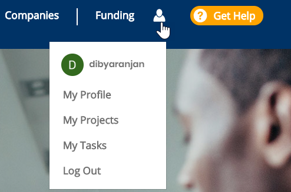
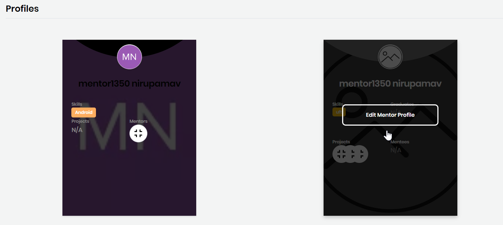

# Manage Your Mentorship Account

Your CommunityBridge Mentorship account lets you manage your Linux Foundation account, and Mentorship profile, projects, and tasks. Based on your role, some or all options are available.

**Follow these steps:**

1. [Log in](../../../sso/user-profile/log-in-to-communitybridge/) to [CommunityBridge Mentorship.](https://people.communitybridge.org/) 
2. Navigate to your user account and select an **option** from the drop-down list:  
   * [My Profile](manage-your-mentorship-account.md#my-profile)
   * [My Projects](manage-your-mentorship-account.md#my-projects)
   * [My Tasks](manage-your-mentorship-account.md#my-tasks)
   * [Log Out](manage-your-mentorship-account.md#log-out)

## My Profile

**My Profile** lets you manage your Linux Foundation identity account and your CommunityBridge profile.‌

* **Manage LFID** opens your Linux Foundation account details, and lets you edit settings such as adding an avatar or more email addresses. Click **Manage LFID** to log in and open your account details. After you edit your account, click **Save**.

### Profiles 

‌**Profiles** lets you edit your Mentorship profile details.‌

**Follow these steps:**‌

1. Mouse over a profile and click **Edit Profile**. A Profile form appears—the form shows the values you chose when you created your profile or last updated it.
2. Edit the profile and click **Submit**.

Following is an example:

## My Projects

My Projects shows the project names based on your role in those projects:

* **Projects for which I am an Administrator**: Shows the project names for which you are an administrator.
* **Projects for which I am a Mentor**: Shows the project names for which you are a mentor.
* **Projects for which I am a Mentee**: Shows the project names for which you are a mentee.

## My Tasks 

‌Your CommunityBridge Mentorship account lets you add and edit tasks. Each task has a status which you assign. These status options give you visibility into the task workflow.‌

### Tasks assigned to my mentees 

‌Tasks that you have assigned are listed. You can change the status of a particular mentee by selecting an option from drop-down list under **Status**.

You can [change status](manage-mentee-tasks.md#change-status), [add](manage-mentee-tasks.md#create-a-task) and [edit](manage-mentee-tasks.md#edit-a-task) a task.

## Log Out

Lets you log out of the CommunityBridge mentorship platform.

