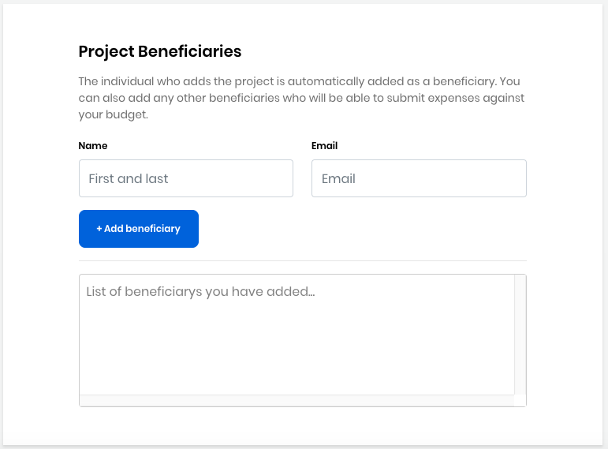

# Set Up a Stipend for a Mentee

You will need to add each mentee as a beneficiary to your mentorship project in order for her to receive a stipend by [submitting an Expensify report](https://app.gitbook.com/@lfdocs/s/docs/~/drafts/-MCm_4iRTomSzspoY-JM/communitybridge/communitybridge-funding/get-reimbursed).

To add can a mentee to the beneficiary section, follow these steps: 

**To Add Mentees:** 

1. [Log in](https://docs.linuxfoundation.org/display/PROD/.Login+to+CommunityBridge+vInitial) to [funding.communitybridge.org](https://funding.communitybridge.org/)
2. Go to your account and select **My Projects** from the drop-down list.
3. Click **Edit Project** on the project to which you want to add a beneficiary.
4. Add each mentee \(beneficiary\) in the Project Beneficiaries section: 
5. **Save Changes.**

