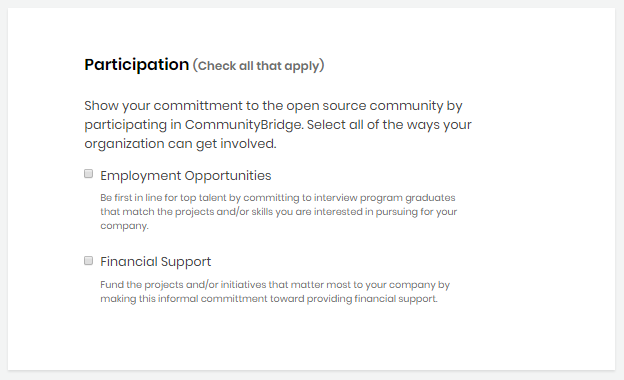
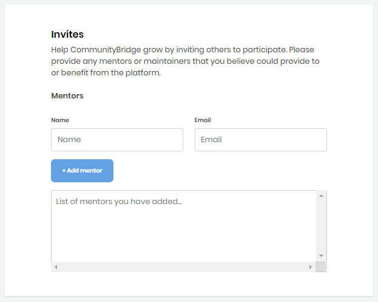

# Create a Company Profile

To connect your company with Mentorship program graduates, you can create a profile on CommunityBridge Mentorship. Your profile lets Mentorship participants see information about your company, such as the skills your company is interested in and employment opportunities. Some of the information in your profile is only available to Linux Foundation administration, such as the Finance Contact for your company.

Keep these items ready before you begin:

* An image file for your company logo in JPG, PNG, SVG format with a maximum size of 2 MB
* Contact information for your company's job interview individual
* A list of the skills that a job candidate should possess
* Contact information for your company's financial support individual

**Do these steps:**

1. Log in to CommunityBridge Mentorship.  
For details, see [Login to CommunityBridge](../../../sso/user-profile/log-in-to-communitybridge/).  
  
2. Click **Companies** on the top menu.  
A Company application form appears.

3. Complete the form fields.  
**Note:** Red asterisks indicate required fields. A bar at the top of the page shows your progress as you click **Next** through the form. Click any of the following links for information about fields that require explanation.

* [Company Details](create-a-company-profile.md#CreateaCompanyProfile-CompanyDetails)
* [Participation](create-a-company-profile.md#CreateaCompanyProfile-Participation)
* [Employment Opportunities](create-a-company-profile.md#CreateaCompanyProfile-EmploymentOpportunities)
* [Financial Support](create-a-company-profile.md#CreateaCompanyProfile-FinancialSupport)
* [Invites](create-a-company-profile.md#CreateaCompanyProfile-Invites)
* [Terms and Conditions](create-a-company-profile.md#CreateaCompanyProfile-TermsandConditions)

4. Read and select the check box. Click **Submit**.  
**Thank You!** page appears. **Fund Now** opens CommunityBridge Funding.  
  
5. Look for a "CommunityBridge: Employer application is pending approval." email in your Inbox.  
The email includes **View Profile** option.   
The Linux Foundation administrator reviews your application and approves or rejects it. You receive an email informing you of the status.

**Note:** You can edit the company details by navigating to **My Profile** section under your account. For details, see **Profiles** section of [Manage Your Mentorship Account](../administrators/manage-your-mentorship-account.md#profiles).

### Company Details 

<table>
  <thead>
    <tr>
      <th style="text-align:left">Name</th>
      <th style="text-align:left">Description</th>
    </tr>
  </thead>
  <tbody>
    <tr>
      <td style="text-align:left"><b>Company Name</b>
      </td>
      <td style="text-align:left">Name of your company. This name will appear on your associated Mentorship
        projects.</td>
    </tr>
    <tr>
      <td style="text-align:left"><b>Company Logo</b>
      </td>
      <td style="text-align:left">
        
logo or symbol or other design that is adopted by your company to identify
          itself. Click <b>Browse</b> to upload a JPG, PNG, or SVG file. Preview shows
          the logo that you uploaded.

        
A logo helps your company stand out.

      </td>
    </tr>
    <tr>
      <td style="text-align:left"><b>Company Bio</b>
      </td>
      <td style="text-align:left">brief description about your company.</td>
    </tr>
  </tbody>
</table>

### Participation 

**Participation** designates the areas your company wants to get involved. Read the description or each option and select the check box based on your choice.

### Employment Opportunities 

This section shows if you select **Employment Opportunities** check box under **Participation**. Below table describes all the fields:

<table>
  <thead>
    <tr>
      <th style="text-align:left">Name</th>
      <th style="text-align:left">Description</th>
    </tr>
  </thead>
  <tbody>
    <tr>
      <td style="text-align:left"><b>Number of Interviews</b>
      </td>
      <td style="text-align:left">Number of interviews that your company will provide to a graduate. Click
        a <b>number</b>.</td>
    </tr>
    <tr>
      <td style="text-align:left"><b>Interview Contact</b>
      </td>
      <td style="text-align:left">Contact information of the person who will provide interview information.</td>
    </tr>
    <tr>
      <td style="text-align:left"><b>Graduate Matching</b>
      </td>
      <td style="text-align:left">
        
Skills that a candidate, who applies for job, should possess. Click in <b>Skill Name </b>field,
          select a <b>skill</b>, and then click <b>+ Add skill</b>.

        
<b>Note: </b>Be specific to help you attract candidates with the right
          skills.

      </td>
    </tr>
    <tr>
      <td style="text-align:left"><b>Projects</b>
      </td>
      <td style="text-align:left">Names of the projects that have employment opportunities. Click in <b>Project Name </b>field,
        select a <b>project</b>, and then click <b>+ Add project</b>.</td>
    </tr>
  </tbody>
</table>

### Financial Support 

This section shows if you select **Financial Support** check box under **Participation**. Below table describes all the fields:

| Name | Description |
| :--- | :--- |
| **Total Funds Committed** | Total funding amount to which your company commits. |
| **Finance Contact** | Contact information of the person who will provide finance related information for your company. |
| **Fund Allocation** | Projects that you want to support or fund. Click in **Project Name** field, select a **project**, and then click **+ Add project**. |
| **Initiative Selection** |  Types of the initiatives that you want to support. Click in **Initiative** field, select an **initiative**, and then click **+ Add initiative**. |

Completing Financial Support section is only the first step and it provides the opportunity to commit the funds. The second step is to complete the donation form, see [Donate to a Project as an Organization](../../communitybridge-funding/donate-sponsor/donate-as-a-project-sponsor/). 

### Invites 

You can invite mentors to participate in the Mentorship program. When your application is approved, the invitees will receive emails asking them to participate.

**Name** is the first name and last name of the employee.

**Email** is the email of the employee. 

Click **+ Add mentor**.

### Terms and Conditions 

Read the terms and conditions, and select the checkbox if you agree.

