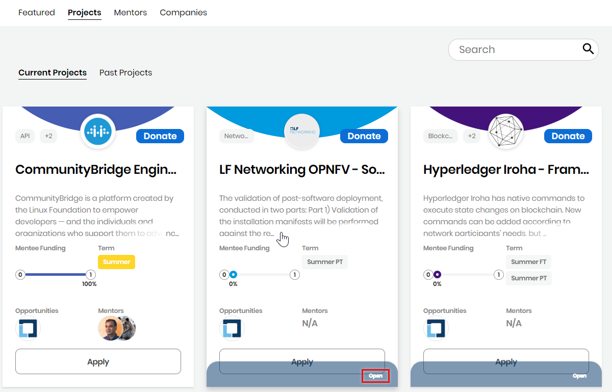
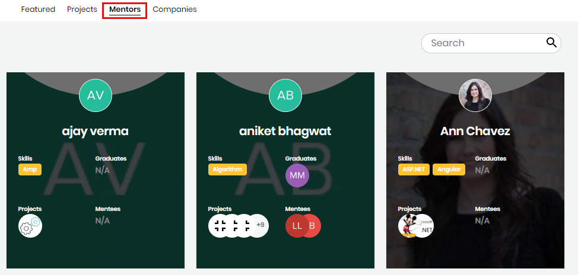
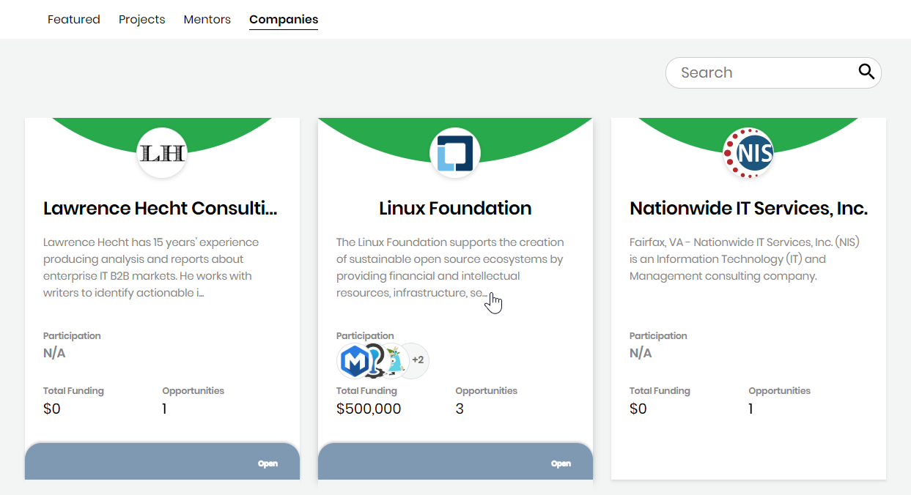

# Dashboard Overview

CommunityBridge Mentorship makes it easy for individuals and companies to get involved in mentorship programs. Mentorship matchmaking can help individual mentees grow as a contributor to open source communities. The program connects Mentorship program applicants with projects; mentees with mentors; projects with donors to provide mentorship stipends; and mentorship graduates with interview opportunities. Get started by discovering projects, mentors, companies, and other aspects of the CommunityBridge mentorship programs.

**Get started:**

1. Open [CommunityBridge Mentorship](https://people.communitybridge.org/). Featured tab appears. Projects, Mentors, and Companies appear in alphabetical order.
2. Navigate to each section, such as Projects, Mentors, Companies, and click an entity under a section to know more about the entity or select a **tab**:
   * [Projects](./#DashboardOverview-Projects)
   * [Mentors](./#DashboardOverview-Mentors)
   * [Companies](./#DashboardOverview-Companies)
3. To view more information:
   * [View Projects Details](view-projects-details.md)
   * [View a Mentor or Mentee Profile](view-a-mentor-or-mentee-profile.md)
   * [Toggle Between Mentorship and Funding](../../communitybridge-funding/dashboard/toggle-between-funding-and-mentorship-for-a-project.md)
4. Participate:
   * As an administrator– [Enroll Your Project](../administrators/enroll-your-project/).
   * As a mentee– [Create a Mentee Profile](../mentees/become-a-mentee/create-a-mentee-profile.md) and then [Apply to a Project](../mentees/become-a-mentee/apply-to-a-project.md).
   * As a mentor–[Create a Mentor Profile](../mentors/become-a-mentor/create-a-mentor-profile.md) and then [Accept to be a Mentor from an Email Invitation](../mentors/become-a-mentor/accept-to-be-a-mentor-from-an-email-invitation.md).
   * As a company: [Create a Company Profile](../companies/create-a-company-profile.md) and then [Donate to the Project](../../communitybridge-funding/donate-sponsor/).

## Projects 

**Projects** shows current and past projects. Navigate to a project card of interest of type a project name in the **Search** box for quick search. Each project card shows the following information: 

* **Project name and logo**. Click the project title or logo to see more information about it.
* **Description** excerpt describes the project. Select the project for more information.
* **Funding To Date** shows the total project fund amount received to date for mentee stipends.
* **Mentors** shows images of mentors for the project.
* **Mentees** shows images of mentees for the project.
* Clicking **CLICK TO APPLY** \(not enabled for past projects\) flips over the project card ****and shows the following information:
  * **Terms** shows the Mentorship program timelines that are available for mentees and mentors.
  * **Required Skills** shows names of the technologies that are required to apply to the project.
  * **Apply** lets you apply to the project.
  * **Applications Closed** is shown when a [project administrator closes applications](../administrators/open-or-close-mentorship-applications.md).
  * **BACK TO PROJECT OVERVIEW** lets you to go back to the overview card
* **Opportunities** shows the logos of the companies that have interview opportunities.

## Mentors 

**Mentors** shows the following features:

* Mentor name and image identify the mentor. Click the name to see more information about the mentor.
* Description briefly describes the mentor. When a description shows only an excerpt, click **open** to see the entire description.
* **Skills** shows keywords that help you match up with a mentor who has direct experience in the industry or subject for which you need help.
* **Graduates** shows the mentees who completed the Mentorship program under this mentor's guidance.
* **Projects** shows the project logos in which the mentor participates/contributes.
* **Mentees** shows the images for the persons who are learning a skill from the mentor.
* Type a mentor name in the **Search** box for quick search.

## Companies 

**Companies** shows the following information:

* Company name and image identify the company.
* Description briefly describes the company. When a description shows only an excerpt, click **open** to see the entire description.
* **Participation** shows the logos for projects in which the company is participating.
* **Total Funding** shows the total funding amount to which the company commits.
* **Opportunities** shows the number of interview opportunities given by the company.

