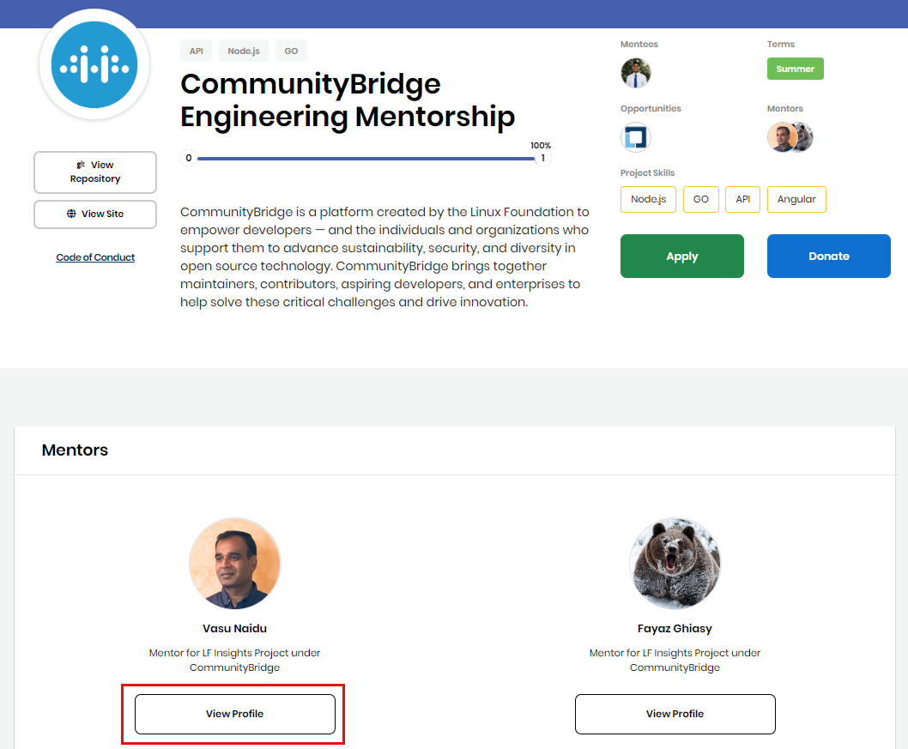

# View a Mentor or Mentee Profile

Learn about a mentor or mentee by viewing their profile, which provides details about the mentor or mentee. You have multiple ways of viewing a profile:

* [View a Profile from the Project Mentors Tab](view-a-mentor-or-mentee-profile.md#view-a-profile-from-the-project-mentors-tab)
* [View a Profile from the Project Details](view-a-mentor-or-mentee-profile.md#view-a-profile-from-the-project-details)
* [View a Profile from a Mentor or Mentee Profile](view-a-mentor-or-mentee-profile.md#ViewaMentororMenteeProfile-ViewaProfilefromaMentororMenteeProfile)

### **View a Profile from the Project Mentors Tab:**

1. Open [CommunityBridge Mentorship](https://people.communitybridge.org/) website.  
Features tab appears. Projects, Mentors, and Companies appear in alphabetical order with their respective entities.

2. Navigate to **Mentors** tab and then click a **mentor** of interest or type mentor's name in the search box.  
The mentor's profile page appears showing projects and mentees the mentor is associated with.

3. Scroll to the Mentees section and click **View Mentee Profile** on a mentee of interest.  
The profile appears, showing projects and mentors, the mentee is associated with.

4. \(Optional\) Click on a project under **Projects** section to know more about the project. For details to know about a project, see [View Projects Details](view-projects-details.md).

### View a Profile from the Project Details

**Do these steps:**

1. Open [CommunityBridge Mentorship](https://people.communitybridge.org/) website.  
Featured tab appears. Projects, Mentors, and Companies appear in alphabetical order with their respective items.

2. Click a **project** of interest form the Projects section or navigate to Projects tab, and click a project of interest.  
The project details page appear.

3. Scroll to the Mentors or Mentees section and click **View Profile** on a mentor or mentee of interest.

The Mentor/Mentee profile appears.

### View a Profile from a Mentor or Mentee Profile 

A Mentee profile shows any associated Mentors. The Mentor profile shows any associated Mentees.

**Do these steps:**

1. Open [CommunityBridge Mentorship](https://people.communitybridge.org/) website.  
Projects, Mentors, and Companies appear in alphabetical order with their respective items.

2. Select a **project** of interest.  
The project details appear.

3. Scroll to the Mentors or Mentees section and click **View Profile** on a mentor or mentee of interest.  
From the mentor or mentee profile, scroll to the corresponding section and mouse over a mentee or mentor.

4. Click **View &lt;Mentee/Mentor&gt; Profile**.

