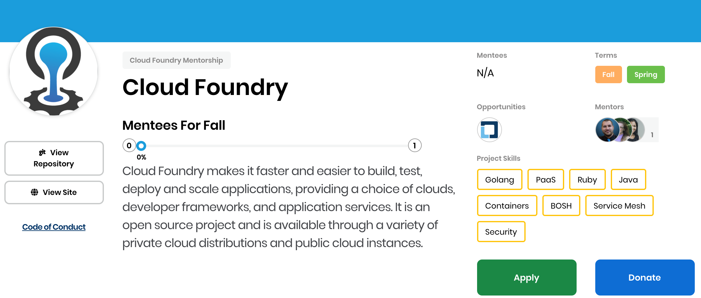
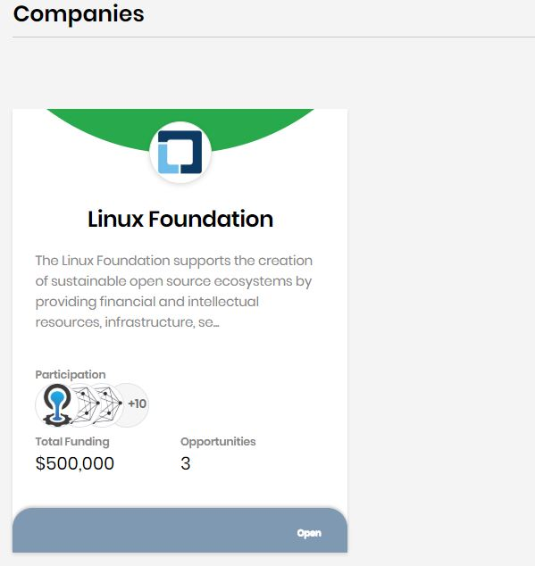

# View Projects Details

Projects details can indicate how active a mentorship is in the open source community. This information can help you decide what particular open source project to participate in. You can also learn about the financial aspects of a project to see if you want to donate to it. Information about the project Mentorship program lets you view the mentee and mentor profile images, the companies that offer interview opportunities, and other details about the project. 

**To View Project Details:**

1. Open [CommunityBridge Mentorship](https://people.communitybridge.org/profile). Projects, Mentors, and Companies appear in alphabetical order with their respective items. 
2. From **Projects** tab, click a **project** of interest. For quick access, you can search for the project by typing the name of the project in the search field. 
3. Browse the details that appear. Depending on the data available, some or all of the following items appear:

<table>
  <thead>
    <tr>
      <th style="text-align:left"><b>Name </b>
      </th>
      <th style="text-align:left">Description</th>
    </tr>
  </thead>
  <tbody>
    <tr>
      <td style="text-align:left">
        
<b>CII badge field</b>
        

        

          
        

      </td>
      <td style="text-align:left">
        <ul>
          <li>Shows that the project is a participant in the <a href="https://www.coreinfrastructure.org/programs/badge-program/">Core Infrastructure Initiative (CII) Badge Program</a>.</li>
          <li>The color of the badge represents the CII status.</li>
          <li>The status is a &quot;tiered %&quot; field&#x2014;the field shows 300%
            for gold, 200% for silver, and 100% for passing, and adds progress after
            the highest-earned badge.</li>
          <li>A CII badge indicates that the project has self-certified that they follow
            best practices for secure open source development.</li>
          <li>Click the <b>badge field</b> to go the project&apos;s CII Best Practices
            page and view the CII details.</li>
        </ul>
      </td>
    </tr>
    <tr>
      <td style="text-align:left"><b>Mentees for &lt;term&gt;</b>
      </td>
      <td style="text-align:left">Shows the percentage of total donations received towards mentee stipends
        for the term, the number of mentees depends on the amount of donations
        received</td>
    </tr>
    <tr>
      <td style="text-align:left"><b>Mentees</b>
      </td>
      <td style="text-align:left">Shows the images of the mentees for the project&apos;s Mentorship program</td>
    </tr>
    <tr>
      <td style="text-align:left"><b>Terms</b>
      </td>
      <td style="text-align:left">Shows the available terms for the project</td>
    </tr>
    <tr>
      <td style="text-align:left"><b>Opportunities</b>
      </td>
      <td style="text-align:left">Shows the logos of companies that are offering interview opportunities.</td>
    </tr>
    <tr>
      <td style="text-align:left"><b>Mentors</b>
      </td>
      <td style="text-align:left">Shows the avatars of the mentors who are participating in the project&apos;s
        Mentorship program</td>
    </tr>
    <tr>
      <td style="text-align:left"><b>Project Skills</b>
      </td>
      <td style="text-align:left">Shows the skills that the project uses, wants, or both</td>
    </tr>
    <tr>
      <td style="text-align:left"><b>View Repository</b>
      </td>
      <td style="text-align:left">Opens the project repository in GitHub</td>
    </tr>
    <tr>
      <td style="text-align:left"><b>View Site</b>
      </td>
      <td style="text-align:left">Opens the associated website</td>
    </tr>
    <tr>
      <td style="text-align:left"><b>Code of Conduct</b>
      </td>
      <td style="text-align:left">Shows the agreement of the rules of behavior for the project. A default
        <a
        href="https://www.contributor-covenant.org/version/1/4/code-of-conduct">Code of Conduct</a>opens when a project does not provide a specific one</td>
    </tr>
    <tr>
      <td style="text-align:left"><b>Apply</b>
      </td>
      <td style="text-align:left">
        <ul>
          <li>Opens the mentee <a href="../mentees/become-a-mentee/create-a-mentee-profile.md#CreateaMenteeProfile-MenteeProfile">application form</a> if
            you have not created a mentee profile.</li>
          <li>Lets you <a href="../mentees/become-a-mentee/apply-to-a-project.md">apply to a project</a> if
            you have created a mentee profile.</li>
        </ul>
      </td>
    </tr>
    <tr>
      <td style="text-align:left"><b>Donate</b>
      </td>
      <td style="text-align:left">Opens a <a href="../../funding/donate-sponsor/donate-to-a-project-as-an-individual.md#result-new-donation-form-appears">New Donation form</a> in
        CommunityBridge Funding. You can donate as an <a href="../../funding/donate-sponsor/donate-to-a-project-as-an-individual.md">individual</a> or
        as an <a href="../../funding/donate-sponsor/donate-as-a-project-sponsor/">organization</a>.</td>
    </tr>
  </tbody>
</table>

**Mentors** section shows the images and brief description of mentors associated with the particular project. Click **View Profile** to know more about a mentor.

**Mentees** section shows the images of mentees associated with the particular project. Click **View Profile** to know more about a mentee.

**Companies** section shows a card briefly describing about the company, logos of projects the company is participating in, total funding amount, and the number of interview opportunities the company is providing.  
If you want to know all the projects the company is participating with, mouse over **Participation** and then click **Open**.

