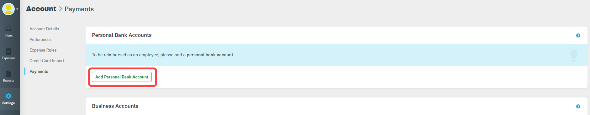

# Submit a Report to Receive Mentorship Stipend

Mentees are required to submit their invoices for mentorship stipends through Expensify before the Mentorship Program administrator approves the invoice.

## Create and Submit an Expensify Report 

1. Login to Expensify [https://www.expensify.com](https://www.expensify.com/)  
Ensure that you use the same email address that you used to set up your account on Expensify.

2. Under your account, select **Reports** tab.

3. On **Reports** page, select **New Report** located in the top-right corner of your screen.

4. A report name along with a report ID is auto-generated based on your profile information. Or,  
Write a report name that must include "_your name - mentee stipend payment &lt;number&gt; of &lt;number&gt;",_ for example...................................

5. Click  to add expense to report.

6. On Add Expense To Report window, click **New Expense**.

6. Create a new expense by completing the following fields:  
     **Merchant:** Your name  
     **Date:** Date of the stipend payment  
     **Total:** Amount of your stipend payment for each evaluation period   
     **Category:** Select a category from the drop-down list  
     **Description:** Name of your mentorship + mentee stipend payment &lt;number&gt; of &lt;number&gt;, for example .....................................................

7. Click  on **New Expense** window to add receipt. \(Is this sentence applicable to U.S. residents\)  
   **Note:** For **International Mentees \(non-U.S.\)**, upload completed _The Linux Foundation Wire Transfer Form_ in place of a receipt, as given below. 



8. Click **Save**.

9. You will be redirected to Report page. Click **Submit** from the top left corner.


**Important:** If you are a United States resident, add a U.S. bank deposit account to Expensify by navigating to  **Settings** &gt; **Account** &gt; **Payments** &gt; **Personal Bank Accounts** as shown below.


**Note:** Each time you will receive a satisfactory mentorship evaluation you will need to submit the invoice to receive your stipend payment. 

**Payment Receipt Timeline:**

* It may take up to 45 business days for the funds to be deposited to your bank account.\*
* \*Wire Transfer recipients will get the funds deposited to their account directly from Linux Foundation.



