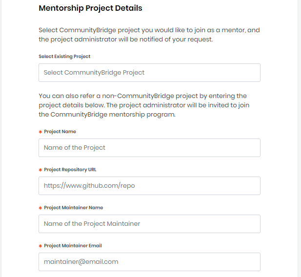

# Create a Mentor Profile

You can create a mentor profile and apply for the project/projects that you are interested in. After you submit an application, the respective project administrator reviews your profile and if your skills match the project requirement, the project administrator sends you an email inviting you to become a mentor for the particular project. You can [accept the invitation](accept-to-be-a-mentor-from-an-email-invitation.md) to become a mentor.

Keep these items ready before you begin:

* Your LinkedIn profile web address
* Your GitHub profile web address
* Your resume in a PDF, DOC, or DOCX format
* An image file for your avatar in JPG, PNG, SVG format with a maximum size of 2 MB
* \(Required\) Information about that project for which you like to mentor individuals: project name, project repository URL, and project administrator name and email

**Follow these steps:**

1. [Sign in](../../../../sso/sign-in/) to [CommunityBridge Mentorship](https://people.communitybridge.org/) website.

2. Click **Become a Mentor** on the top menu.  
A Mentor Application appears.

3. Complete the form fields.  
**Note:** Red asterisks indicate required fields. A bar at the top of the page shows your progress as you click **Next** through the form. Click any of the following links for information about fields.

* [Mentor Profile](create-a-mentor-profile.md#CreateaMentorProfile-MentorProfile)
* [Introduction](create-a-mentor-profile.md#CreateaMentorProfile-Introduction)
* [Skills](create-a-mentor-profile.md#CreateaMentorProfile-Skills)
* [External Profile Links](create-a-mentor-profile.md#CreateaMentorProfile-ExternalProfileLinks)
* [Project Details](create-a-mentor-profile.md#CreateaMentorProfile-ProjectDetails)
* [Terms and Conditions](create-a-mentor-profile.md#CreateaMentorProfile-TermsandConditions)

4. Select the check box and click **Submit**.  
     **Profile Created** page appears. You can click **My Profile** to see your profile status on your account page.  
  
5. Look for a _CommunityBridge Team: Your CommunityBridge mentor profile was successfully created_ email in your Inbox.  
The email includes **View Profile** option.  
**Note:** The Project Administrator of the project for which you applied to be a mentor, reviews your profile and sends you an invitation if your skills match the project requirement.

**See:** 

[Manage Your Mentorship Account](../../administrators/manage-your-mentorship-account.md)

### Mentor Profile 

Some fields are pre-filled with your Linux Foundation account values. The Linux Foundation uses your email address for corresponding with you.

Your avatar \(image\) represents you on your associated CommunityBridge Mentorship projects. Click **Browse** to upload a JPG, PNG, or SVG file. Preview shows the image that you uploaded.

### Introduction 

Introduce yourself to project administrators and inform them why you would excel as a mentor for a project.

### Skills 

Click in the **Skill Name** filed, select a skill, and click **+Add skill** to add your current skills.

### External Profile Links 

Showcase your experience by providing links to your external profiles pages, and upload your resume file. Your external profile links will appear on your mentor card in Mentorship.

### Project Details 

Provide information about the project for which you like to mentor individuals.

### Terms and Conditions 

Read the Terms and Conditions, and select the checkbox.

