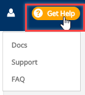

# Mentorship - Get Help

**To Get Help:** 

Go to **Get Help** and select an **option** from the drop-down list:

**Docs** opens the Linux [Foundation Product Documentation](https://docs.linuxfoundation.org/).  
**Support** open the Help Center.  
**FAQ** opens the Mentorship FAQs.  

