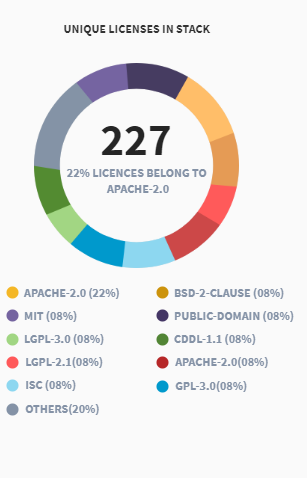

# Security

Only members of Linux Foundation can see security dashboard. The below screen appears if you are not a member of Linux Foundation or are not logged in as a member.

## SECURITY HIGHLIGHTS

### UNIQUE LICENSE IN STACK

Represents a doughnut chart that shows total number of licenses \(in the middle of the chart\), and name of individual licenses by percentage with respect to the license's usage in all projects. This chart shows the top 10 licenses by name, and all other licenses are grouped in **OTHERS** category.

The value in the middle of the doughnut chart shows the total number of licenses. Mouse over a color to see the license name, and its percentage of usage.

### REMEDIATION RATE

Shows a bar graph that represents total number of vulnerabilities count for all the projects from the time the projects were on-boarded to CommunityBridge Security for scanning.

* **Upstream** shows total number of vulnerabilities found in libraries code, and percentage wise breakup of total number of vulnerabilities into fixes recommended and not recommended categories.
* **Base** shows total number of  vulnerabilities found in base code, and percentage wise breakup of total number of vulnerabilities into fixes recommended and not recommended categories.

Mouse over a color to see the total number of vulnerabilities for recommended or not recommended category.

### LANGUAGE DISTRIBUTION ACROSS PROJECTS

Represents a doughnut chart that shows total number of projects \(in the middle of the chart\), and name of individual programming languages by percentage with respect to the language's usage in all projects. This chart shows the top 10 licenses by name, and all other licenses are grouped in **OTHERS** category.

The value in the middle of the doughnut chart shows the total number of projects. Mouse over a color to see the language name, and its percentage of usage.

### Transitive Dependencies

Represents a bar graph that groups all the projects based on their number of dependencies \(shown in X-axis\), and shows total number of projects in Y-axis. In the following is example, 16 represents the number of projects whose dependency count is between 0 to 50:


**Note:** Depending upon the dependency numbers for projects, the dependency range \(in X-axis\) varies for better representation. For example, the frequency buckets or dependency number might show 0-10, 11-20, 21-30, 31-40, and so on.


### TOTAL NO. OF PROJECTS ACROSS MAXIMUM STACK DEPTH

Shows colored bubbles that represents the total number of projects in each bubble based on the stack depth of the packages in the project's repositories.For example, projects whose packages have stack depth of 2 will be counted and grouped in the green bubble that shows 0-2 maximum stack depth, and so on.

### ACTIVITY LOG

Shows activities for your projects, such as project name, activity status for your project repositories, and date and time of activity. Click  and select a project of interest from the drop-down list to view activities for the project.

### PROJECTS WITH VULNERABILITY DETECTION

Shows list of projects that have vulnerabilities. By default, card view is shown. Click  for list view of your projects. Each project card shows the following details for a project:

* project name, logo, and description
* **Vulnerability Report:** shows number of issues based on severity level, fixable issues for each severity, total number of issues and total number of fixable issues.
* **Updated:** Date and time of last scan for the project repositories in MM DD YYYY format along with the timezone name.
* Click **View Details** to know more about [vulnerability details](https://docs.linuxfoundation.org/community-bridge/projects#security) of the project.
* Click **Show more** to view more project cards

​

