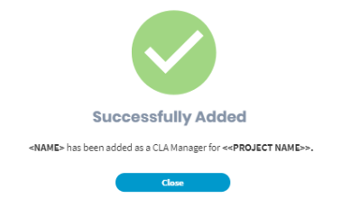
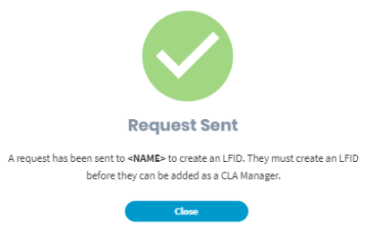

# How to Add or Delete a CLA Manager


**Important:** Only CLA managers can add a user as a CLA manager, and delete an added CLA manager. Each project has at least one CLA manager. If a project has one CLA manager, the person's details cannot be deleted.


### To Add a CLA Manager:

1. Click **+ Add CLA Manager**.

2. On **Adding CLA Manager** window, type first name, last name, email address, and click **Add**.

3. **Results:**

* **If the user, being added, has LFID:** A screen appears confirming that the user is successfully added as a CLA manager.   **** 
* **If the user, being added, doesn't have LFID:** A request is sent to the user's email address with the link to create an LFID. After the user creates an LFID, you must [add](how-to-add-or-delete-a-cla-manager.md#to-add-a-cla-manager) the user as a CLA manager.   

### To Delete a CLA Manager

Click  under **Action** column on a CLA manager's row to delete the user. For a single entry, you cannot delete the CLA manager's details.

