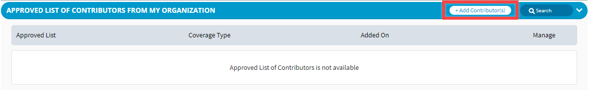
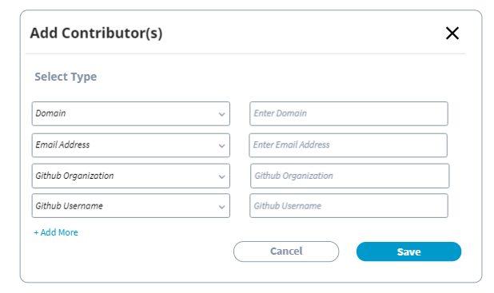

# How to Add or Delete a Contributor


**Important:** Only CLA managers can add or delete a contributor for the project for which the user is added as a CLA manager.


### To Add a Contributor:

1. Click **+Add Contributor\(s\)**.

2. On **Add Contributor\(s\)** window, select an option from the **Select Type** drop-down list, and type details in the filed for the value that you selected.  
**Note:** The option that you select is displayed under **Coverage Type** column for a contributor for Approved List of Contributors section.

3. Click **+Add More** to add other details for a contributor.  
**Note:** GitHub Organization and GitHub Username are not required while adding contributors to gerrit projects.

4. Click **Save**.

