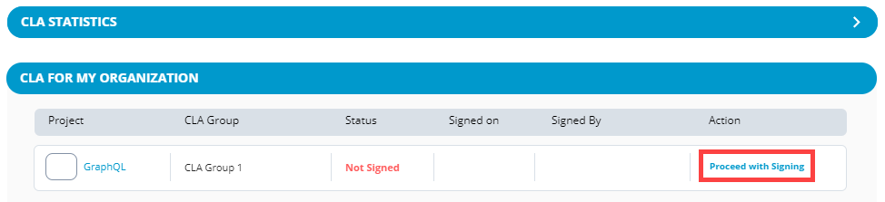

# How to Sign CLA with Project

1. Click **Start the CLA process**.

2. Click an answer: **Are you authorized to be a CLA Manager for your organization?**

* **Yes**— A **Configuring CLA Manager Settings** window appears. After the configuration settings is completed, click **Proceed**, and continue to step 4.
* **No**— An **Identify CLA Manager** form appears. Continue to next step.

3. Complete the form, and click **Submit Request**, ****Or click **Contact Company Admin**.  
A window appears confirming that request is submitted to respective individual.

4. Under **Action** column, click **Proceed with Signing**.

5. Click an answer: **Are you authorized to sign CLAs on your company's behalf?  
Yes**— Review CCLA \(Corporate Contributor License Agreement\) window appears. Click **Review & Sign CCLA**, and continue to step 7.  
    
**No**— An **Identify Authorized Signatory** form appears. Continue to next step.  
  

6. Complete the form, and click **Send Signature Request Email**.  
A success window appears confirming that the signature request is sent to the email address.

7. Once CCLA preparation is complete, click **SIGN CCLA** on CCLA Ready for Signature window.

**Result:** You will be redirected to the project page, and your name and email address appear under **CLA MANAGERS FROM MY ORGANIZATION**. Following is an example:

