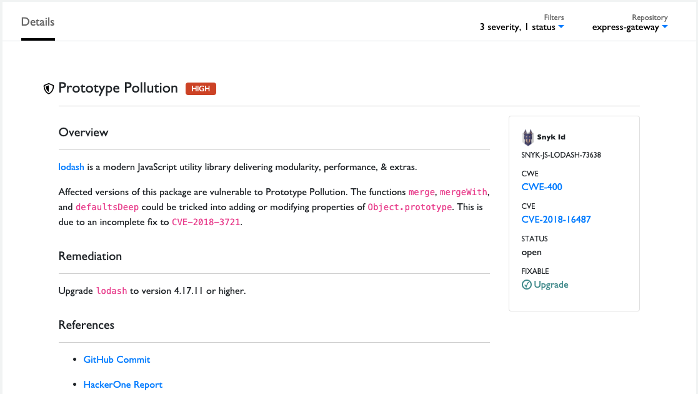
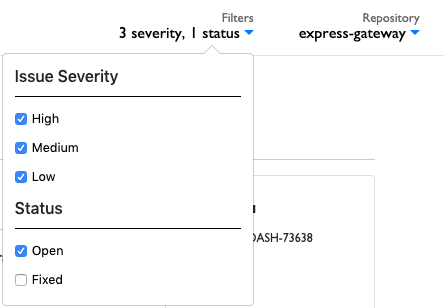
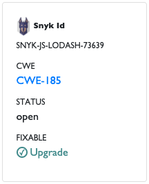

# Investigate and Remediate Vulnerabilities

Vulnerabilities in project code can cause a range of problems for your project and the developers who use it. CommunityBridge Security shows vulnerabilities in your repositories and helps you to remediate risks with automated updates and patches. For each repository, CommunityBridge Security maps the dependencies and correlates them with the vulnerability database. You can investigate and remediate certain types of vulnerabilities in your Git repository. For example, an injection vulnerability means your project does not guard against code being injected in your system to extract, damage, or destroy data. Investigate the issue details to find out how to remediate the vulnerability if possible.

If possible, address a vulnerability by upgrading to a vulnerability-free version of the package you are using. If you cannot upgrade, because no sufficient direct upgrade is available or because the upgrade includes breaking changes, another option is to apply a patch. A patch changes the locally installed package file to fix the vulnerability. If an upgrade or patch is unavailable, assess the issue and weigh risk against effort. If the risk is high, consider removing the dependency.

**Do these steps:**

1. Select **Issues** from the top menu.  
Types of vulnerabilities such as Information Exposure and External Entity Injection appear with their details. By default, only Open status issues appear—use the filter to show Fixed issues.

2. \(Optional\) Narrow your issue results:

* Mark any of the **checkboxes** on Filters to narrow your issue results by Issue Severity and Status. These filters help you focus your attention on issues of concern, for example, issues with a High severity and an Open status. The Filters heading refreshes to match your selections for easy reference.  
* Select a **repository** \(and optionally a **project**\) from the Repository drop-down list. 

3. Investigate the vulnerabilities by opening the provided links to go directly to various websites for specific information about the vulnerability. For example:

* Click a **GitHub PR** link, a **GitHub Commit**, and then a **GitHub Issue** link to learn more about the corresponding pull request, commit, and issue, respectively.
* Click a **CWE-\#** link or **CVE-\#** link to read a description, references, and so on, about the vulnerability. The [Common Weakness Enumeration website](https://cwe.mitre.org/) or [Common Vulnerabilities and Exposures website](https://cve.mitre.org/) shows an identifier and details for the vulnerability by an identifier.

4. Read about the vulnerabilities. Details about the issue, and when possible, a remediation and references to the corresponding PR, issue, CWE or CVE record, and so on. Read the details and decide how you want to fix the vulnerability, for example, by applying a Snyk patch.  

5. Use this information to understand and remediate the issue if possible.

