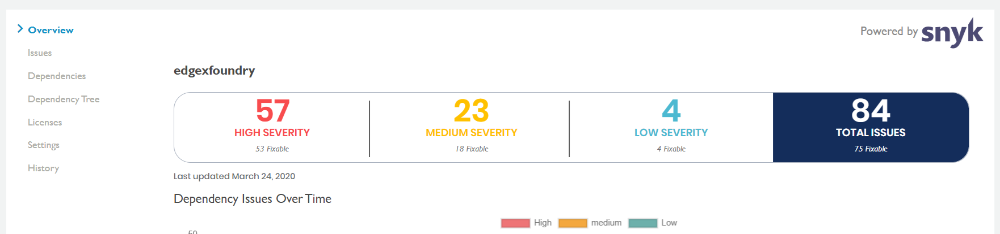

# Open CommunityBridge Vulnerability Detection

Vulnerability Detection detects vulnerabilities in CommunityBridge projects. Projects that are part of the CommunityBridge receive free daily scans via the Vulnerability Detection service in order to detect vulnerabilities in code repositories as well as library dependencies. CommunityBridge projects include a Vulnerability Report, which gives an overview of vulnerability severities. 


Only project maintainers can access Vulnerability Detection details to gain visibility into open security issues and paths to remediation.


As a project maintainer, you can access vulnerability scan details for projects based on the CommunityBridge service you opted while enrolling your project:

* [Projects applied to CommunityBridge Funding](open-communitybridge-vulnerability-detection.md#projects-applied-to-communitybridge-funding)
* [Projects applied to CommunityBridge Vulnerability Detection](open-communitybridge-vulnerability-detection.md#projects-applied-to-communitybridge-vulnerability-detetction)

**Note:** If you are not a project maintainer and/or not authorized to see vulnerability report for a project, you can [request access](open-communitybridge-vulnerability-detection.md#requesting-access-to-view-vulnerability-report) to see vulnerability scan details.

### Projects applied to CommunityBridge Funding

To see vulnerability scan deatils for projects applied to CommunityBridge Funding:

1. [Log in](../../sso/log-in-to-communitybridge/) to [CommunityBridge Funding](https://funding.communitybridge.org/) website.
2. From dashboard, click a **project** of interest or navigate to your user account  and select **My Projects** to see your projects. A dashboard shows various aspects of the project including a Vulnerability Report.
3. Navigate to the Vulnerability Report card, and mouse over a **severity level**.. **Note:** Log in if a Login Now prompt appears.      CommunityBridge Vulnerability Detection appears and shows the Overview dashboard. 
4. Access other dashboards by selecting a menu name to investigate vulnerabilities by using the data in the dashboards

### Projects applied to CommunityBridge Vulnerability Detection

To see vulnerability scan details for projects applied to CommunityBridge Vulnerability Detection:

1. Log in to  [CommunityBridge Vulnerability Detection](https://security.communitybridge.org/#/) website. A dashboard shows various aspects of the project, and a Vulnerability Report. 
2. Navigate to your user account  and select **My Projects** to see your projects.
3. On a project card of interest, click **Contributor Login**. Vulnerability Detection details appear and shows the Overview dashboard.
4. Access other dashboards by selecting a menu name to investigate vulnerabilities by using the data in the dashboards.

### Requesting Access to view Vulnerability Report

If you are not authorized to see vulnerability report for a project, **Not Authorized** pane appears when you click **Contributor Login** on a project of interest. To request access:

1. Click **Request Access**.    CommunityBridge Vulnerability Detection help center request form opens.
2. Complete all the fields, and click **Create**.    CommuntiyBridge support team reviews your request and informs you about your access permission.

