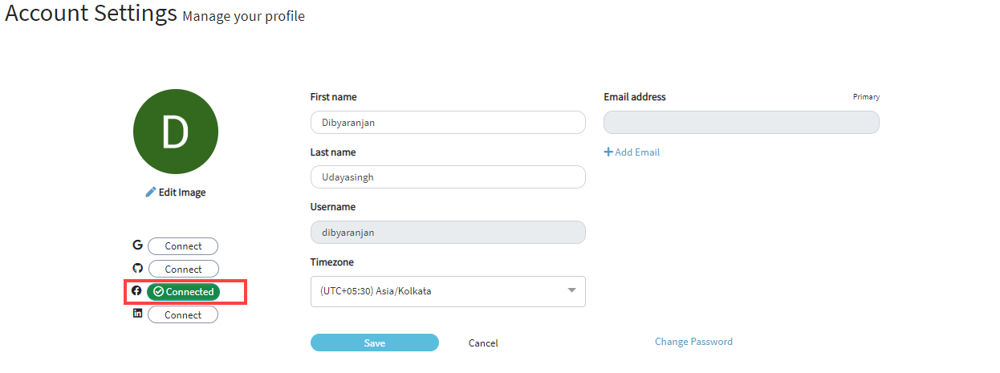
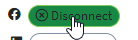

# Connect/Disconnect your Facebook Account

​[&lt;&lt;Back](account-settings.md#to-edit-profile)​

## Connect your Facebook account 

You can connect your facebook account to CommunityBridge account.

1. On the Account Settings page, click **Connect** next to facebook sign.  
You are navigated to your Facebook login page if you are connecting your facebook account for the first time.

2. Enter your facebook credentials, and click Sign in.   
The Connect but changes to green color confirming the successful connection.The text on the button changes to _Connected_.  ​​

## Disconnect your Facebook Account 

1. When you move your mouse over the green _Connected_ button, you are provided with an option to _disconnect_ your facebook account.

The text changes to _Disconnect_.  

2. Click **Disconnect**. On the Confirm Social Disconnection window, click **Yes** to confirm your disconnection.   
You are now disconnected from your facebook account.

​[&lt;&lt;Back](account-settings.md#to-edit-profile)​

