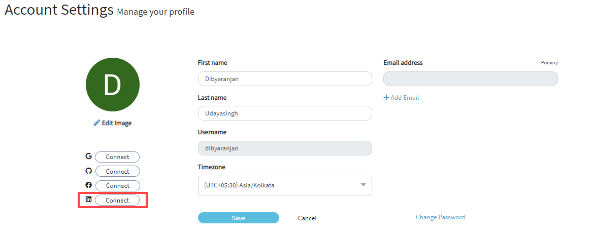

# Connect/Disconnect your LinkedIn Account

​[&lt;&lt;Back](account-settings.md#to-edit-profile)​

## Connect your LinkedIn Account 

You can connect to LinkedIn account from your CommunityBridge account.

1. On the Account Settings page, click **Connect** next to LinkedIn sign. You are navigated to the linked login page if you are connecting your github account for the first time.

2. Enter your username and password, and click Sign In.  
The Connect button changes to green color confirming the successful connection.The text on the button changes to _Connected_.  ​

## Disconnect your LinkedIn Account 

1. When you move your mouse over the green _Connected_ button, you are provided with an option to _disconnect_ your LinkedIn account.

The text changes to _Disconnect_.​​  

2. Click **Disconnect**. On the Confirm Social Disconnection window, click **Yes** to confirm your disconnection.   
You are now disconnected your LinkedIn account.

​[&lt;&lt;Back](account-settings.md#to-edit-profile)​

