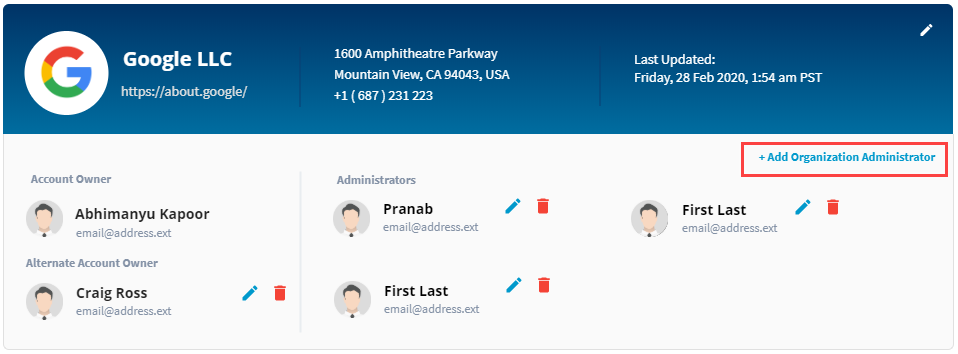
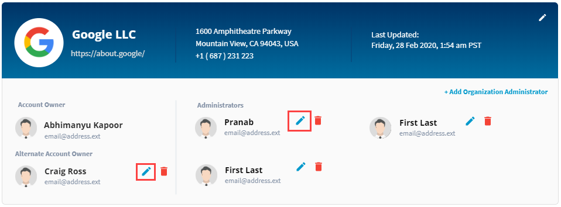
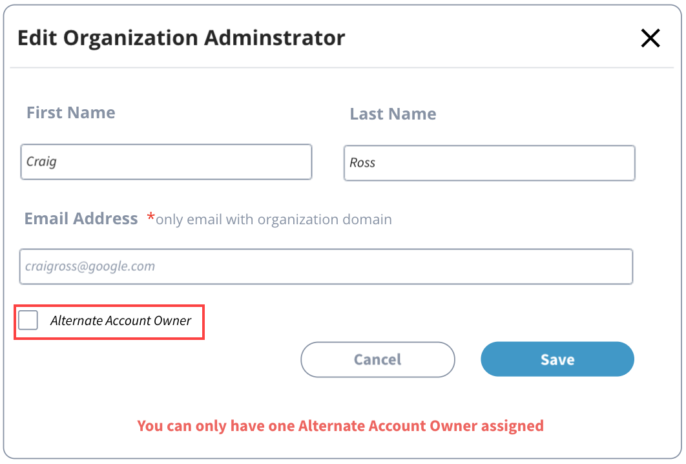

# Manage Your Organization

The organization profile header shows the organization name, logo, website URL, address, contact information, and last updated date and time.

### How to Edit Organization Information ? 

1. On the organization profile header, click  . 

2. The Edit Organization Information screen appears. You can update the following details as mentioned in the following table:

| **Field** | **Action** |
| :--- | :--- |
| **Organization Logo**  | Click Upload logo to upload your organization logo |
| **Organization Name** | Update your organization name  |
| **Website** | Update the organization website url |
| **Street Address** | Update the street address of your organization |
| **City**  | Update the city of the organization |
| **State/Province** | Update the state/province of the organization |
| **Postal  Code** | Update the postal  code of the organization |
| **Country**  | Update the country of the organization |
| **Telephone Number** | Update the telephone number of the organization |


You cannot edit the company name.


3.After updating the fields, click **Save** to update your organization.

### Add/Delete Organization Administrator/Alternate Account Owner

Below Organization profile header section, you can see a section where you can add/delete administrators or co-owner for your organization. If you have already added administrators for your organization, this section shows the profile photos, names, and email addresses of administrators of your organization.

#### To Add an Organization Admin/Alternate Account Owner: 

1. Click **+Add Organization Administrator**.

2. On **Add Organization Administrator** page, type the name who you want to add as an administrator in the **Search** filed, and select the name once the name shows in the search list. The fields are populated automatically with the selected user's information.  
**Note:** If the name doesn't show in the search list, enter user details in the fields. 

3. \(Optional\)Select the **Alternate Account Owner** check box if you want to nominate the administrator as the co-owner for your company.  
**Note:** You can have only one alternate account owner for your company.

4. Click **Save**.

#### To Edit an Administrator profile: 

1. Click  next to the administrator's name whose profile information you want to update.

2. On **Edit Organization Administrator** page, change the first name and last name.   
**Note:** You cannot edit the email address.

3. \(Optional\)Select the **Alternate Account Owner** check box of you want to nominate the administrator as the co-owner for your organization.

4. Click **Save**.

#### To Delete an Administrator profile:  

Click  next to an administrator's profile to delete the profile.

## EasyCLA Roles 

This section shows a table that lists your team members— their profile photos, names and email addresses, their roles with foundation and projects they are associated with. Team member roles are auto populated from the Salesforce database.


You cannot edit or delete CLA role\(s\) for a team member.


If a user has more than one role, click **View More Roles** to know more about the other roles the user is associated with.

