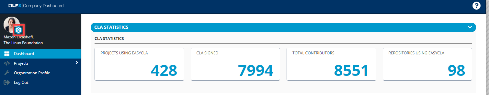

# Manage your Profile

Linux Foundation allows you to edit your existing Linux Foundation profile using **My Profile**.

On the home page, click the Settings  icon to navigate to My Profile page. For more information on how to manage your profile using My Profile page, see [My Profile](https://docs.linuxfoundation.org/docs/my-profile).

