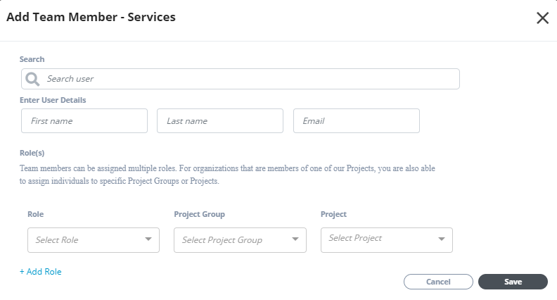

# Organization Profile

Only organization administrators can edit and update organization information. You are entitled as organization administrators if your are:

* Added by another administrator
* CLA manager of the organization
* Primary contact for the organization

Organization Profile displays the following sections:

* [Organization Profile Header](organization-profile.md#organization-profile-header)
* [Addresses](organization-profile.md#addresses)
* [Organization Account Administrators](organization-profile.md#organization-account-administrators)
* [Team Member Roles - Services](organization-profile.md#team-member-roles-services)
* [Team Contacts - Membership](organization-profile.md#team-contacts-membership)
* [Team Member Roles - Committee](organization-profile.md#team-member-roles-committee)

### Organization Profile Header

This section shows organization name, logo, primary address, and last updated time and date.

#### To Edit Organization Information:

Only organization administrators can edit organization information.

1. Click  on the profile header.

2. Update or edit logo, name, and website of an organization, and click **Save**.  
     **Note:** Only SVG files are accepted for company logo.

### Addresses

This section displays the organization addresses:

* Primary address ****is the main address of the organization. If you add another address, that will be the billing address for the organization.
* Billing addresses can be one or more.

#### To Add an Address:

Only Organization administrators can add and/or edit an address.

1.  Click **Add Address** from the Address section.

2. Provide details, and click **Save**.

#### To Edit an Address:

1.Click the pencil icon next to an address, update details, and click **Save**.

### Organization Account Administrators

This section shows details about organization administrators:

* **Name** shows the name, email address, and image of the administrator. _**ID Not Verified**_  ****is displayed if the administrator does not have an LF SSO account. After the individual creates and verifies SSO account, the status is removed.
* **Appointed By** shows how the individual is entitled the role of administrator.
* **Manage** \(only for administrators\) lets administrators unassign the role for an individual. _**Unassign**_ is not displayed if there is only one administrator for an organization.
* **Assign** \(only for administrators\) lets administrators [assign](organization-profile.md#to-assign-organization-administrator) the administrator role to individuals.

#### To Assign Organization Administrator:

1. Click **Assign**.
2. Type the name in the Search field, and click the name from search options.
3. If the name is not displayed from search, click **User not Found. Enter Details below**.
4. Enter first name, last name, email address with organization domain, and click **Save**.

#### To Unassign Administrator:

Click **Unassign** next to an administrator.

### Team Member Roles - Services

This section shows a table that lists your team members— their profile photos, names, email addresses, and their roles with project groups and projects they are associated with. If a member has more than one role, click **View More Roles** to know more about the other roles the member is associated with.

As an administrator, you must add roles for team members of the company after company account is created. CLA roles are displayed automatically as per the organization profile information.


You cannot edit or delete CLA role\(s\) of a team member.


* **Add Team Members** \(only for Administrators\) lets you [add](organization-profile.md#add-a-team-member) a team member.
* **Manage** \(only for Administrators\) lets you [edit or delete](organization-profile.md#edit-a-team-member-role) a role. You cannot edit or delete a CLA role.

#### Add a Team Member:

1. Click **Add Team Member**.

 2. Type full name in the Search user field, and click the name from the drop-down list or enter first name, last name, and email address of the user in the respective fields of Enter User Details.

3. Select the role, project group and project from the drop-down lists to assign to the user.

4. Click **+Add Role** to assign multiple roles to the user for multiple projects.

5. Click **Save**.

#### Edit a Team Member Role

To edit a role, click the pencil icon  next to a user. Make updates, and click **Save**.

#### Delete a Team Member Role

Click  next to a user to delete the role.

### Team Contacts - Membership

This section shows a table that lists contact members of the organization. It displays the individual name, email address, and contact type, such as primary, legal, technical, and so on. Click a project or project group from the drop down to view contacts for the project.

**Manage Team Members** \(only for administrators\) lets you add, edit and delete a contact for your organization.

#### To Add a Contact:

1. Click **Manage Team Members**.

2. On **Manage Team Contacts - Membership** page, click **Add Contact**.

3. Select contact type from the drop-down list, provide first name, last name, email address, and click **Save**.

#### To Set a Contact Type:

Select the check box next to a contact to set contact type for the member.

#### To Delete a Contact:

Click the delete icon  beside a contact to delete.

### Team Member Roles - Committee

This section shows a table that lists committees of the organization, associated project or project group name, name and email address of the team member, associated role with the committee, start and end date of the role, and who appointed the role to the member.

The table lets you sort values by project/project group, and committee. Click the filter icon, select values, and click **Apply** to filter the table values.

