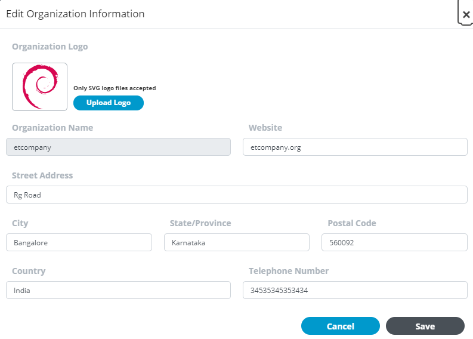
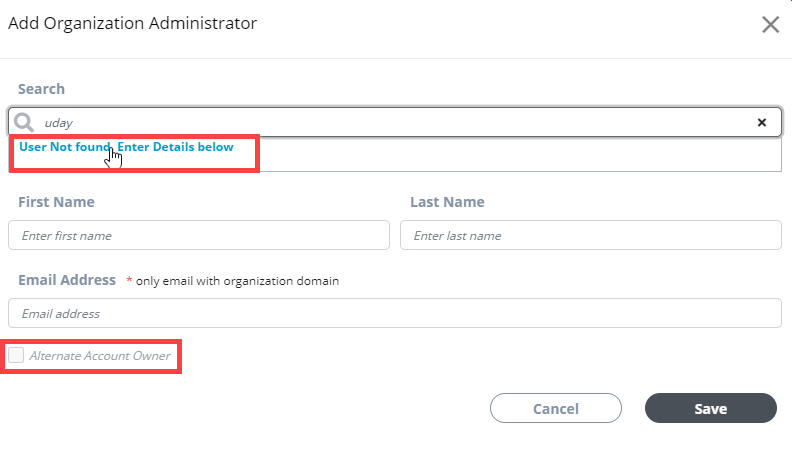
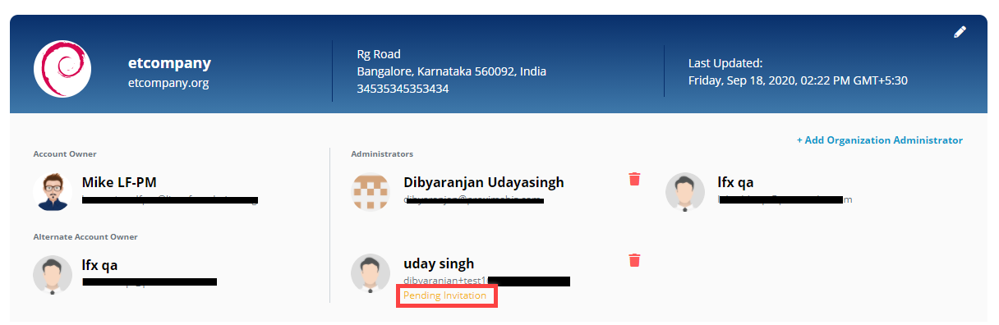
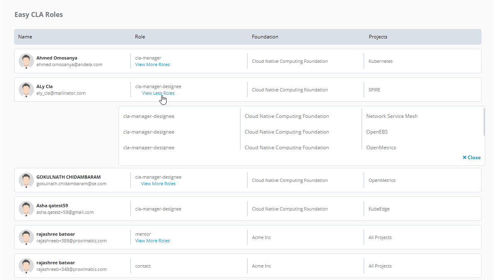

# Organization Profile

Only organization administrators can edit and update organization information. Individuals are entitled as organization administrators if they are:

* Added by another administrator
* CLA managers of the organization
* Primary contacts for an organization

Organization Profile displays the following sections:

* [Organization Profile Header](organization-profile.md#organization-profile-header)
* [Addresses](organization-profile.md#addresses)
* [Organization Account Administrators](organization-profile.md#organization-account-administrators)
* [Team Member Roles - Services](organization-profile.md#team-member-roles-services-1)
* [Team Contacts - Membership](organization-profile.md#team-contacts-membership)
* [Team Member Roles - Committee](organization-profile.md#team-member-roles-services-1)

### Organization Profile Header

This section shows organization name, logo, primary address, and last updated time and date.

#### To Edit Organization Information:

Only organization administrators can edit organization information.

1. Click  on the profile header.

2. Update or edit logo, name, and website of an organization, and click **Save**.  
     **Note:** Only SVG files are accepted for company logo.

### Addresses

This section displays the organization addresses:

* Primary address ****is the main address of the organization. If you add another address, that will be the billing address for the organization.
* Billing addresses can be one or more.

#### To Add an Address:

Only Organization administrators can add and/or edit an address.

1.  Click **Add Address** from the Address section.

2. Provide details, and click **Save**.

#### To Edit an Address:

1.Click the pencil icon next to an address, update details, and click **Save**.

### Organization Account Administrators

This section shows details about organization administrators:

* **Name** shows the name, email address, and image of the administrator. _**ID Not Verified**_  ****is displayed if the administrator does not have an LF SSO account. After the individual creates and verifies SSO account, the status is removed.
* **Appointed By** shows how the individual is entitled the role of administrator.
* **Manage** \(only for administrators\) lets administrators unassign the role for an individual. _**Unassign**_ is not displayed if there is only one administrator for an organization.
* **Assign** \(only for administrators\) lets administrators [assign](organization-profile.md#to-assign-organization-administrator) the administrator role to individuals.

#### To Assign Organization Administrator:

### Team Member Roles - Services

### Team Contacts - Membership

### Team Member Roles - Committee

As organization administrator, you can update organization information, add additional administrators, and manage services, memberships and community roles for your organization.

### Add or Delete Organization Administrator 

Below Organization profile header section, you can see a section where you can add/delete administrators or co-owner for your organization. If you have already added administrators for your organization, this section shows the profile photos, names, and email addresses of administrators of your organization.

#### Add an Organization Administrator: 

1. Click **+Add Organization Administrator**.

2. On **Add Organization Administrator** page, type the name who you want to add as an administrator in the **Search** field, and select the name once the name shows in the search list. The fields are populated automatically with the selected user's information.

**Note:** If the name doesn't show in the search list, click **User Not Found. Enter Details below**, and enter user details in the fields as shown below.

3. \(Optional\)Select the **Alternate Account Owner** check box if you want to nominate the administrator as the co-owner for your company.  
**Note:** You can have only one alternate account owner or co-owner for your company.

4. Click **Save**.

**Note:** If the user you added as an administrator doesn't have a [Single Sign-On \(SSO\)](../../sso/) account with Linux Foundation, **Pending Invitation** shows next to their name as shown in the image below. The individual receives an invitation email from Linux Foundation. After they accept the invitation, and create their SSO account with Linux Foundation, they become administrators for your organization.

### Delete an Administrator profile: 

Click  next to an administrator's profile, and click **Yes** on confirmation page to delete the profile.

## EasyCLA Roles 

This section shows a table that lists your team members— their profile photos, names and email addresses, their roles with foundation and projects they are associated with. Team member roles are auto populated from the Salesforce database.


You cannot edit or delete CLA role\(s\) of a team member.


If a user has more than one role, click **View More Roles** to know more about the other roles the user is associated with.

